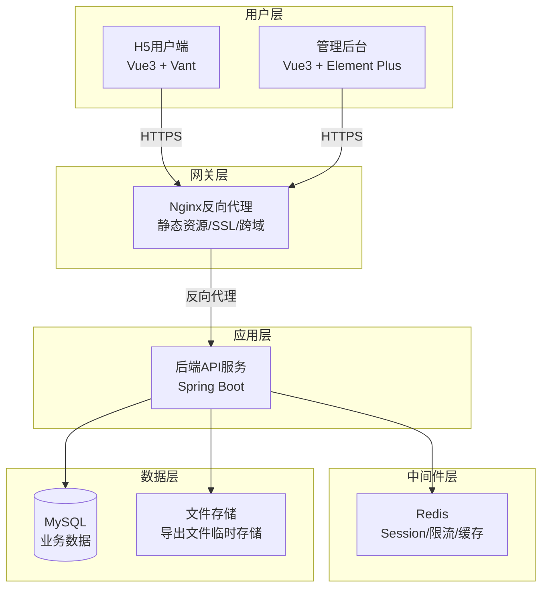
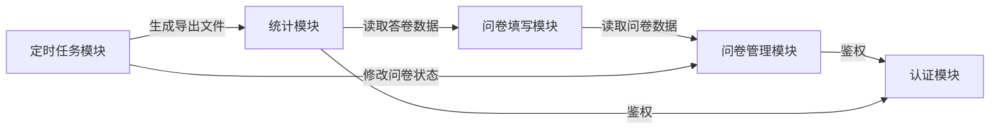
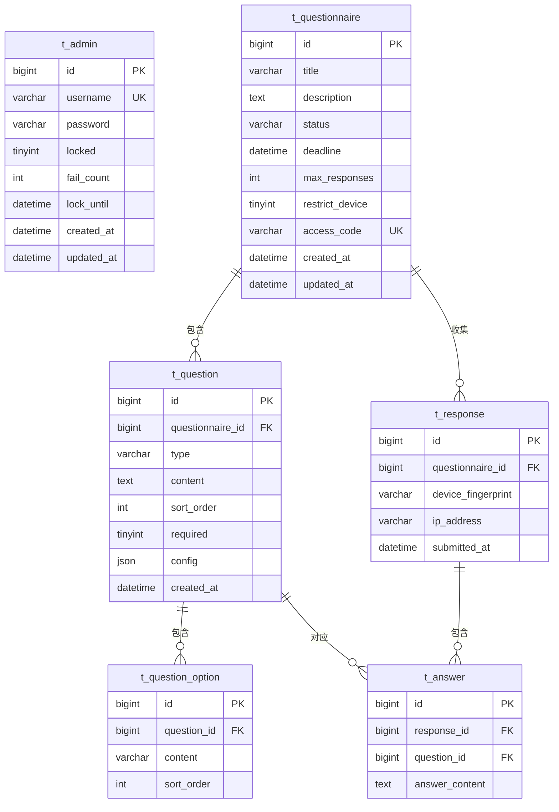
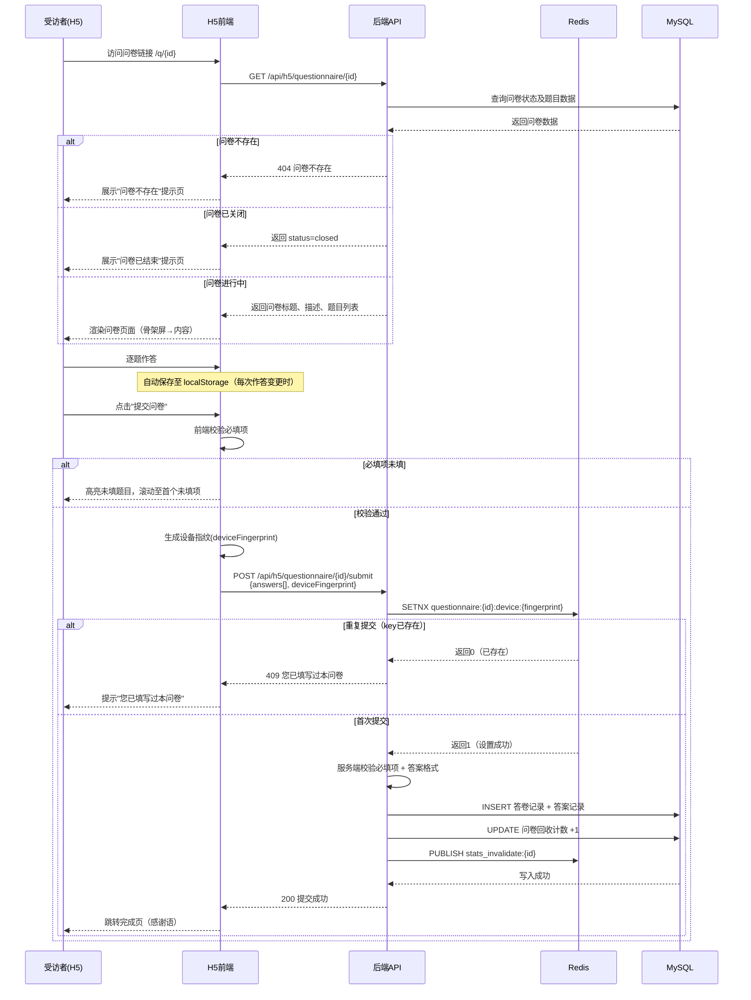
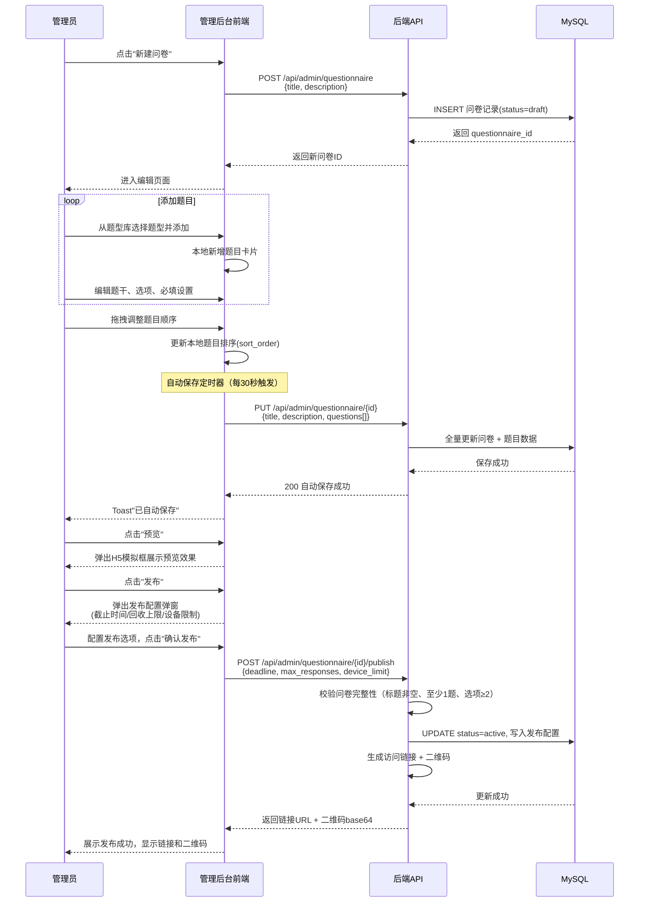
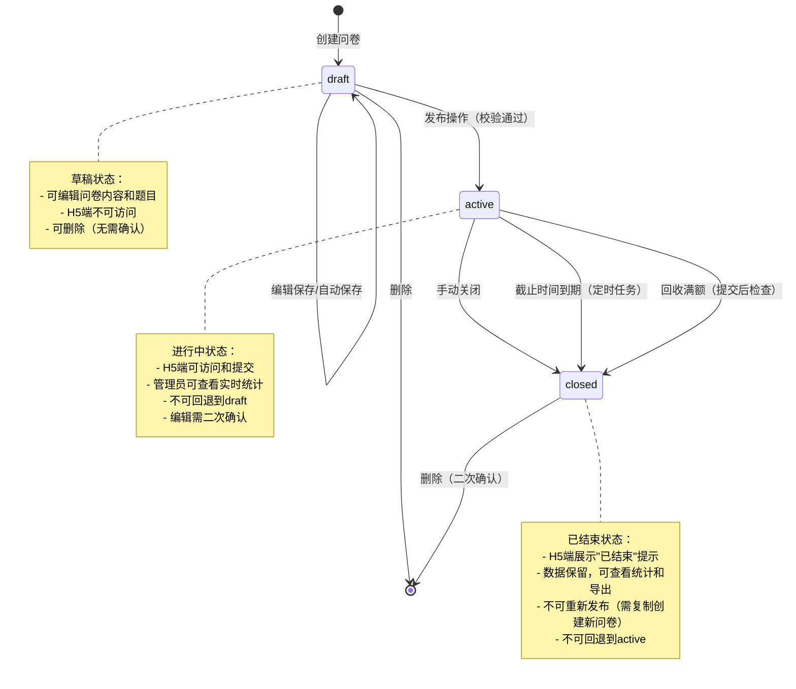
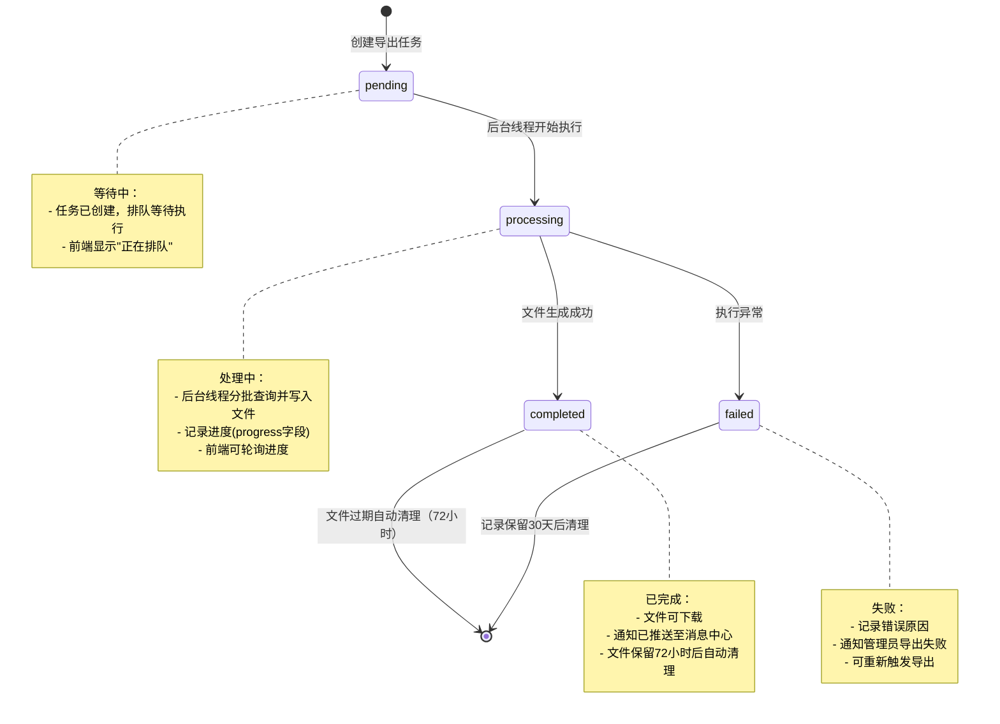
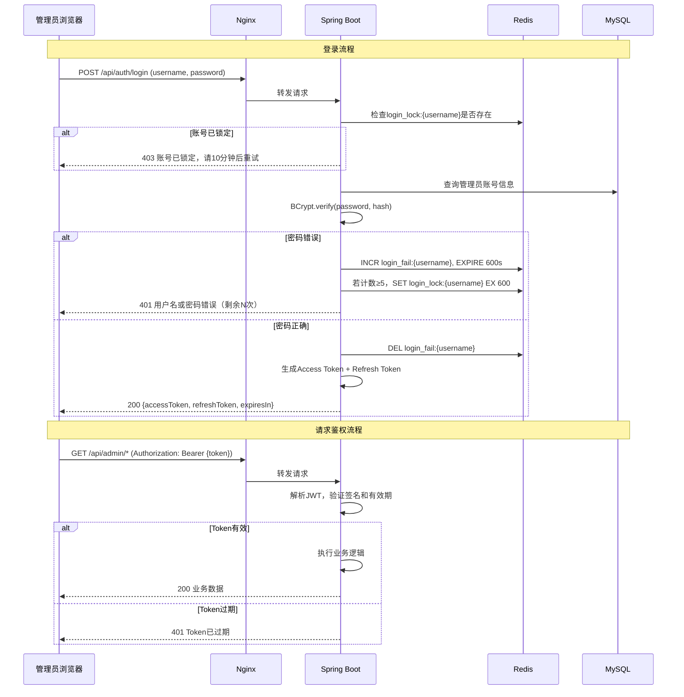

# 问卷调查平台 软件设计说明

**Version**: 1.0  
**Date**: 2026-05-09  
**Author**: 软件设计团队  
**关联需求文档**: 小型问卷调查平台PRD v1.0  

---

## 第0章 需求覆盖追踪矩阵

### 0.1 功能需求清单

| 状态 | 编号 | 描述 | 来源 | 设计落地 |
|------|------|------|------|----------|
| [x] | FR-001 | 问卷填写与提交（H5端无登录访问、作答、提交） | 需求文档#功能一 | 第4.3章接口 + 第6.1章流程 |
| [x] | FR-002 | 题目类型展示与交互（单选/多选/填空/评分/下拉） | 需求文档#C端子功能2 | 第3.2章表结构 + 第4.3章接口 + 第6.1章流程 |
| [x] | FR-003 | 提交校验与完成页（必填校验、提交成功页） | 需求文档#C端子功能3 | 第4.3章接口 + 第7.4章校验规则 |
| [x] | FR-004 | 问卷创建与题目编排（可视化编辑器、拖拽排序） | 需求文档#功能二 | 第4.2章接口 + 第6.1章流程 |
| [x] | FR-005 | 问卷管理（列表、发布、暂停、关闭、删除、复制） | 需求文档#功能三 | 第4.2章接口 |
| [x] | FR-006 | 发布配置（截止时间、回收上限、设备限制） | 需求文档#管理后台子功能3 | 第4.2章发布接口 |
| [x] | FR-007 | 生成问卷访问链接和二维码 | 需求文档#管理后台子功能3 | 第4.2章链接/二维码接口 |
| [x] | FR-008 | 回收数据统计概览（总量、今日新增、趋势图） | 需求文档#功能四/统计概览 | 第4.4章统计概览接口 |
| [x] | FR-009 | 逐题统计（选择题图表、填空题原文列表） | 需求文档#功能四/逐题统计 | 第4.4章逐题统计接口 |
| [x] | FR-010 | 数据导出（Excel/CSV格式） | 需求文档#功能四/数据导出 | 第4.4章导出接口 + 第6.1章导出流程 |
| [x] | FR-011 | 管理员登录（账号密码验证、Token鉴权） | 需求文档#管理后台功能三 | 第4.1章认证接口 + 第9.1章认证方案 |
| [x] | FR-012 | 同一设备重复提交限制 | 需求文档#功能一边界 | 第4.3章提交接口 + 第6.2章算法 |
| [x] | FR-013 | 问卷状态自动流转（截止时间到期、回收满额自动关闭） | 需求文档#功能三边界 | 第6.2章调度算法 + 第6.3章状态机 |
| [x] | FR-014 | 编辑过程自动保存草稿（每30秒） | 需求文档#功能二流程 | 第4.2章草稿接口 + 第6.1章流程 |
| [x] | FR-015 | 问卷预览（H5效果预览） | 需求文档#功能二流程 | 第4.2章预览接口 |

### 0.2 非功能需求清单

| 状态 | 编号 | 描述 | 来源 | 设计落地 |
|------|------|------|------|----------|
| [x] | NFR-001 | H5页面首屏加载 ≤ 2秒（P90），资源 < 500KB gzip | 需求文档#成功指标/技术约束 | 第8章部署方案(Nginx gzip+缓存) |
| [x] | NFR-002 | 数据统计延迟 ≤ 1分钟 | 需求文档#成功指标 | 第6.2章统计缓存算法 |
| [x] | NFR-003 | H5提交接口频率限制（同IP 1分钟≤10次） | 需求文档#安全要求 | 第9.3章防刷策略 + 第7.3章并发控制 |
| [x] | NFR-004 | 管理后台 HTTPS + JWT Token 鉴权，Token有效期8小时 | 需求文档#安全要求 | 第9.1章认证授权方案 |
| [x] | NFR-005 | 密码连续错误5次锁定账号10分钟 | 需求文档#管理员登录 | 第9.3章登录锁定 + 第7.2章错误码 |
| [x] | NFR-006 | 导出数据量>5万条时异步生成 | 需求文档#数据导出 | 第6.2章异步导出算法 + 第6.3章状态机 |
| [x] | NFR-007 | 管理后台支持分辨率1280px以上 | 需求文档#管理后台布局 | 第6.4章前端适配设计 |
| [x] | NFR-008 | 微信内置浏览器兼容 | 需求文档#技术约束 | 第8章Nginx配置 |

### 0.3 数据实体清单

| 状态 | 编号 | 描述 | 来源 | 设计落地 |
|------|------|------|------|----------|
| [x] | ENT-001 | 问卷（Questionnaire）：标题、描述、状态、配置 | 需求文档#术语表/功能二 | 第3.2章 t_questionnaire表 |
| [x] | ENT-002 | 题目（Question）：题型、题干、选项、排序、必填标识 | 需求文档#功能二/C端子功能2 | 第3.2章 t_question表 |
| [x] | ENT-003 | 题目选项（QuestionOption）：选项文字、排序 | 需求文档#C端子功能2 | 第3.2章 t_question_option表 |
| [x] | ENT-004 | 答卷（Response）：提交时间、设备标识、问卷关联 | 需求文档#术语表/功能一 | 第3.2章 t_response表 |
| [x] | ENT-005 | 答案（Answer）：题目关联、答案内容 | 需求文档#功能一/功能四 | 第3.2章 t_answer表 |
| [x] | ENT-006 | 管理员（Admin）：用户名、密码、锁定状态 | 需求文档#管理员登录 | 第3.2章 t_admin表 |

### 0.4 用户角色清单

| 状态 | 编号 | 描述 | 来源 | 设计落地 |
|------|------|------|------|----------|
| [x] | ROLE-001 | 受访者：无需登录，通过链接/二维码填写问卷 | 需求文档#用户画像/主要角色 | 第9.1章(H5免认证) + 第4.3章 |
| [x] | ROLE-002 | 问卷管理员：登录后管理问卷全生命周期 | 需求文档#用户画像/次要角色 | 第9.1章认证方案 + 第4.1/4.2章 |

---

## 文档结构（完整章节大纲）

- 第0章 需求覆盖追踪矩阵
- 第1章 设计概述
  - 1.1 系统目标与范围
  - 1.2 设计约束与假设条件
  - 1.3 术语表
- 第2章 系统架构设计
  - 2.1 整体架构图
  - 2.2 模块划分与职责
  - 2.3 模块间依赖关系
  - 2.4 技术选型说明
- 第3章 数据库设计
  - 3.1 ER关系图
  - 3.2 数据表结构设计
  - 3.3 索引设计
  - 3.4 数据初始化方案
- 第4章 接口设计
  - 4.1 认证模块接口
  - 4.2 问卷管理模块接口
  - 4.3 问卷填写模块接口（H5端）
  - 4.4 数据统计模块接口
- 第5章 前后端接口对接规范
  - 5.1 数据传输规范
  - 5.2 错误处理规范
  - 5.3 接口版本管理
  - 5.4 跨域配置
- 第6章 模块详细设计
  - 6.1 核心业务流程
  - 6.2 关键算法说明
  - 6.3 状态机设计
- 第7章 异常与边界处理
  - 7.1 全局异常处理策略
  - 7.2 业务异常编码表
  - 7.3 并发控制方案
  - 7.4 数据校验规则
- 第8章 部署架构与方案
  - 8.1 部署拓扑图
  - 8.2 环境要求
  - 8.3 端口规划
  - 8.4 构建步骤
  - 8.5 配置项清单
- 第9章 安全设计
  - 9.1 认证授权方案
  - 9.2 敏感数据保护
  - 9.3 防注入与防刷策略
- 附录 设计完整性检查报告

---

## 第1章 设计概述

### 1.1 系统目标与范围

本系统为小型问卷调查平台，包含两大子系统：

1. **H5用户端**（面向受访者）：提供无需登录的问卷填写体验，通过链接或二维码访问，支持多种题型作答和提交。（对应需求文档#执行摘要、#功能一）
2. **管理后台**（面向问卷管理员）：提供问卷的可视化创建与编排、生命周期管理、回收数据统计与导出功能。（对应需求文档#执行摘要、#功能二/三/四）

**系统边界**（对应需求文档#范围外）：
- 不包含受访者账号体系
- 不包含问卷逻辑跳转
- 不支持多管理员权限分级（本期单一管理员）
- 不包含移动端原生App
- 不包含付费/激励机制
- 不支持自定义问卷样式/皮肤
- 不支持多语言国际化

### 1.2 设计约束与假设条件

**设计约束**：
- H5端首屏资源 < 500KB（gzip后），首屏加载 ≤ 2秒（P90）
- 管理后台支持1280px及以上分辨率
- 需兼容微信内置浏览器
- 数据提交后统计延迟 ≤ 1分钟
- 本期单管理员，不做多租户设计

**假设条件**：
- [假设] 系统并发量为中小规模（同时在线填写用户 ≤ 500）
- [假设] 单份问卷最大回收量 ≤ 10万条
- [假设] 管理员同时在线数 ≤ 5
- [假设] 系统部署于单台服务器或单实例容器，不做集群扩展设计
- [假设] 数据库使用单实例MySQL，不做读写分离

### 1.3 术语表

| 术语 | 英文 | 说明 |
|------|------|------|
| 问卷 | Questionnaire | 由一组有序题目构成的调查表单，具有唯一访问链接 |
| 题目 | Question | 问卷中的单个调查条目，包含题干和对应的输入控件 |
| 答卷 | Response | 一名受访者完整填写并提交的一份问卷数据 |
| 回收数量 | Response Count | 某问卷已成功提交的答卷总数 |
| 草稿 | Draft | 尚未发布的问卷状态，不可被受访者访问 |
| 进行中 | Active | 已发布、当前可接受填写的问卷状态 |
| 已结束 | Closed | 手动关闭、到期或满额后的问卷状态 |
| 题型 | Question Type | 题目的类型分类（单选/多选/填空/评分/下拉） |
| 设备指纹 | Device Fingerprint | 用于识别同一设备重复提交的标识信息 |

---

## 第2章 系统架构设计

### 2.1 整体架构图



**架构说明**：采用经典的前后端分离三层架构：
- **表现层**：H5端和管理后台分别为独立的SPA应用，通过RESTful API与后端通信
- **应用层**：Spring Boot单体服务，按业务模块组织代码，对外提供统一REST接口
- **数据层**：MySQL存储核心业务数据，Redis用于缓存/会话/限流，文件存储用于导出文件

### 2.2 模块划分与职责

| 模块名称 | 职责说明 | 输入 | 输出 |
|----------|----------|------|------|
| **认证模块（Auth）** | 管理员登录验证、Token签发与校验、登录锁定 | 用户名/密码 | JWT Token |
| **问卷管理模块（Questionnaire）** | 问卷CRUD、题目编排、发布/关闭、状态管理 | 问卷配置数据 | 问卷数据、访问链接/二维码 |
| **问卷填写模块（Fill）** | H5端问卷数据获取、答卷提交、重复提交检测 | 问卷ID、答案数据 | 问卷内容、提交结果 |
| **统计模块（Statistics）** | 回收数据聚合统计、逐题分析、数据导出 | 问卷ID、筛选条件 | 统计数据、导出文件 |
| **定时任务模块（Scheduler）** | 问卷自动关闭（到期/满额）、异步导出 | 定时触发 | 状态变更、文件生成 |

### 2.3 模块间依赖关系



**依赖规则**：
- 认证模块为基础模块，被所有管理后台模块依赖
- 问卷填写模块不依赖认证模块（H5端无需登录）
- 统计模块读取答卷数据进行聚合计算
- 定时任务模块跨模块调用，执行状态流转和异步导出

### 2.4 技术选型说明

| 层次 | 技术选型 | 选型理由 |
|------|----------|----------|
| H5前端框架 | Vue 3 + Vite + Vant 4 | 需求文档指定Vue3；Vant为成熟的移动端组件库，轻量高效；Vite构建速度快 |
| 管理后台前端 | Vue 3 + Vite + Element Plus | 需求文档指定Vue3 + Element Plus；企业级组件库，表格/表单/图表生态完善 |
| 图表库 | ECharts 5 | 需求文档#参考资料推荐；支持饼图/柱状图/折线图，社区活跃 |
| 后端框架 | Spring Boot 3.x | 需求文档指定；Java生态成熟，企业级稳定性好 |
| 数据库 | MySQL 8.0 | 需求文档指定；关系型数据适合问卷结构化存储 |
| 缓存 | Redis 7.x | 需求文档指定；Session管理、接口限流、热点数据缓存 |
| 认证方案 | JWT（JSON Web Token） | 需求文档指定；无状态鉴权，前后端分离友好 |
| 二维码生成 | ZXing（后端） | 开源Java二维码库，轻量无额外依赖 |
| 文件导出 | Apache POI / EasyExcel | 支持Excel/CSV导出，EasyExcel内存优化适合大数据量 |
| 反向代理 | Nginx | 静态资源托管、SSL终结、跨域处理、负载转发 |

---
## 第3章 数据库设计

### 3.1 ER关系图



**关系说明**：
- 一份问卷（t_questionnaire）包含多道题目（t_question）—— 1:N（对应 ENT-001、ENT-002）
- 一道题目（t_question）包含多个选项（t_question_option）—— 1:N（对应 ENT-002、ENT-003）
- 一份问卷（t_questionnaire）收集多份答卷（t_response）—— 1:N（对应 ENT-001、ENT-004）
- 一份答卷（t_response）包含多条答案（t_answer）—— 1:N（对应 ENT-004、ENT-005）
- 一道题目（t_question）对应多条答案（t_answer）—— 1:N（对应 ENT-002、ENT-005）
- 管理员（t_admin）独立管理所有问卷（对应 ENT-006）

---

### 3.2 数据表结构设计

#### 3.2.1 t_admin（管理员表）（对应 ENT-006）

| 字段名 | 类型 | 约束 | 说明 |
|---|---|---|---|
| id | BIGINT | PRIMARY KEY, AUTO_INCREMENT | 主键ID |
| username | VARCHAR(50) | NOT NULL, UNIQUE | 登录用户名 |
| password | VARCHAR(255) | NOT NULL | 密码（BCrypt加密存储） |
| locked | TINYINT(1) | NOT NULL, DEFAULT 0 | 是否锁定（0-否，1-是） |
| fail_count | INT | NOT NULL, DEFAULT 0 | 连续登录失败次数 |
| lock_until | DATETIME | NULL | 锁定解除时间（NULL表示未锁定） |
| created_at | DATETIME | NOT NULL, DEFAULT CURRENT_TIMESTAMP | 创建时间 |
| updated_at | DATETIME | NOT NULL, DEFAULT CURRENT_TIMESTAMP ON UPDATE CURRENT_TIMESTAMP | 更新时间 |

#### 3.2.2 t_questionnaire（问卷表）（对应 ENT-001）

| 字段名 | 类型 | 约束 | 说明 |
|---|---|---|---|
| id | BIGINT | PRIMARY KEY, AUTO_INCREMENT | 主键ID |
| title | VARCHAR(100) | NOT NULL | 问卷标题（最长100字） |
| description | TEXT | NULL | 问卷描述/说明文字 |
| status | VARCHAR(10) | NOT NULL, DEFAULT 'draft' | 问卷状态：draft(草稿)/active(进行中)/closed(已结束) |
| deadline | DATETIME | NULL | 截止时间（NULL表示不限制） |
| max_responses | INT | NULL | 最大回收数（NULL表示不限制） |
| restrict_device | TINYINT(1) | NOT NULL, DEFAULT 0 | 是否限制同一设备重复提交（0-否，1-是） |
| access_code | VARCHAR(32) | NOT NULL, UNIQUE | 问卷访问链接唯一标识（UUID短码） |
| created_at | DATETIME | NOT NULL, DEFAULT CURRENT_TIMESTAMP | 创建时间 |
| updated_at | DATETIME | NOT NULL, DEFAULT CURRENT_TIMESTAMP ON UPDATE CURRENT_TIMESTAMP | 更新时间 |

#### 3.2.3 t_question（题目表）（对应 ENT-002）

| 字段名 | 类型 | 约束 | 说明 |
|---|---|---|---|
| id | BIGINT | PRIMARY KEY, AUTO_INCREMENT | 主键ID |
| questionnaire_id | BIGINT | NOT NULL, FOREIGN KEY → t_questionnaire(id) | 所属问卷ID |
| type | VARCHAR(20) | NOT NULL | 题型：radio(单选)/checkbox(多选)/text(单行填空)/textarea(多行填空)/rating(评分)/dropdown(下拉) |
| content | TEXT | NOT NULL | 题干文字 |
| sort_order | INT | NOT NULL, DEFAULT 0 | 排序号（升序排列） |
| required | TINYINT(1) | NOT NULL, DEFAULT 1 | 是否必填（0-否，1-是） |
| config | JSON | NULL | 题目配置JSON，如：{"maxRating":5}(评分最大值)、{"maxLength":500}(文本长度限制)、{"minSelect":1,"maxSelect":3}(多选限制) |
| created_at | DATETIME | NOT NULL, DEFAULT CURRENT_TIMESTAMP | 创建时间 |

#### 3.2.4 t_question_option（选项表）（对应 ENT-003）

| 字段名 | 类型 | 约束 | 说明 |
|---|---|---|---|
| id | BIGINT | PRIMARY KEY, AUTO_INCREMENT | 主键ID |
| question_id | BIGINT | NOT NULL, FOREIGN KEY → t_question(id) | 所属题目ID |
| content | VARCHAR(200) | NOT NULL | 选项文字（最长200字） |
| sort_order | INT | NOT NULL, DEFAULT 0 | 选项排序号（升序排列） |

#### 3.2.5 t_response（答卷表）（对应 ENT-004）

| 字段名 | 类型 | 约束 | 说明 |
|---|---|---|---|
| id | BIGINT | PRIMARY KEY, AUTO_INCREMENT | 主键ID |
| questionnaire_id | BIGINT | NOT NULL, FOREIGN KEY → t_questionnaire(id) | 所属问卷ID |
| device_fingerprint | VARCHAR(64) | NULL | 设备指纹（用于重复提交检测） |
| ip_address | VARCHAR(45) | NULL | 提交者IP地址（兼容IPv6） |
| submitted_at | DATETIME | NOT NULL, DEFAULT CURRENT_TIMESTAMP | 提交时间 |

#### 3.2.6 t_answer（答案表）（对应 ENT-005）

| 字段名 | 类型 | 约束 | 说明 |
|---|---|---|---|
| id | BIGINT | PRIMARY KEY, AUTO_INCREMENT | 主键ID |
| response_id | BIGINT | NOT NULL, FOREIGN KEY → t_response(id) | 所属答卷ID |
| question_id | BIGINT | NOT NULL, FOREIGN KEY → t_question(id) | 对应题目ID |
| answer_content | TEXT | NULL | 答案内容（统一文本存储：选择题存选项ID，多选用逗号分隔；填空题存原文；评分题存分值） |

---

### 3.3 索引设计

#### 3.3.1 t_admin 索引

| 索引名 | 字段 | 类型 | 用途 |
|---|---|---|---|
| PRIMARY | id | 主键索引 | 主键查询 |
| uk_username | username | 唯一索引 | 登录时按用户名查询，保证唯一性 |

#### 3.3.2 t_questionnaire 索引

| 索引名 | 字段 | 类型 | 用途 |
|---|---|---|---|
| PRIMARY | id | 主键索引 | 主键查询 |
| uk_access_code | access_code | 唯一索引 | H5端通过访问标识加载问卷，保证唯一性 |
| idx_status_created | status, created_at | 普通索引（联合） | 管理后台按状态筛选+时间排序查询问卷列表 |

#### 3.3.3 t_question 索引

| 索引名 | 字段 | 类型 | 用途 |
|---|---|---|---|
| PRIMARY | id | 主键索引 | 主键查询 |
| idx_questionnaire_sort | questionnaire_id, sort_order | 普通索引（联合） | 按问卷ID查询题目并按排序号排列 |

#### 3.3.4 t_question_option 索引

| 索引名 | 字段 | 类型 | 用途 |
|---|---|---|---|
| PRIMARY | id | 主键索引 | 主键查询 |
| idx_question_sort | question_id, sort_order | 普通索引（联合） | 按题目ID查询选项并按排序号排列 |

#### 3.3.5 t_response 索引

| 索引名 | 字段 | 类型 | 用途 |
|---|---|---|---|
| PRIMARY | id | 主键索引 | 主键查询 |
| idx_questionnaire_time | questionnaire_id, submitted_at | 普通索引（联合） | 按问卷查询答卷列表、按时间范围统计 |
| idx_device_check | questionnaire_id, device_fingerprint | 普通索引（联合） | 同一设备重复提交检测 |

#### 3.3.6 t_answer 索引

| 索引名 | 字段 | 类型 | 用途 |
|---|---|---|---|
| PRIMARY | id | 主键索引 | 主键查询 |
| idx_response_id | response_id | 普通索引 | 按答卷ID查询该答卷全部答案 |
| idx_question_id | question_id | 普通索引 | 按题目ID聚合统计（逐题统计功能） |

---

### 3.4 数据初始化方案

系统部署后需执行以下数据初始化操作：

#### 3.4.1 初始管理员账号（对应 ENT-006）

系统预置一个默认管理员账号，首次登录后强烈建议修改密码。

```sql
-- 初始管理员账号
-- 用户名: admin
-- 初始密码: admin123（BCrypt加密后存储）
INSERT INTO t_admin (username, password, locked, fail_count, created_at, updated_at)
VALUES (
    'admin',
    '$2a$10$N9qo8uLOickgx2ZMRZoMyeIjZAgcfl7p92ldGxad68LJZdL17lhWy',
    0,
    0,
    NOW(),
    NOW()
);
```

#### 3.4.2 初始化说明

| 初始化项 | 内容 | 备注 |
|---|---|---|
| 管理员账号 | admin / admin123 | BCrypt加密存储，生产环境部署后应立即修改密码 |
| 问卷数据 | 无 | 系统启动后由管理员手动创建 |
| 数据字典 | 无需初始化 | 题型、状态等枚举值在应用层代码中定义 |

#### 3.4.3 DDL建表脚本

```sql
-- 创建数据库
CREATE DATABASE IF NOT EXISTS questionnaire_db
    DEFAULT CHARACTER SET utf8mb4
    DEFAULT COLLATE utf8mb4_unicode_ci;

USE questionnaire_db;

-- 管理员表
CREATE TABLE t_admin (
    id BIGINT AUTO_INCREMENT PRIMARY KEY,
    username VARCHAR(50) NOT NULL,
    password VARCHAR(255) NOT NULL,
    locked TINYINT(1) NOT NULL DEFAULT 0,
    fail_count INT NOT NULL DEFAULT 0,
    lock_until DATETIME NULL,
    created_at DATETIME NOT NULL DEFAULT CURRENT_TIMESTAMP,
    updated_at DATETIME NOT NULL DEFAULT CURRENT_TIMESTAMP ON UPDATE CURRENT_TIMESTAMP,
    UNIQUE KEY uk_username (username)
) ENGINE=InnoDB DEFAULT CHARSET=utf8mb4 COLLATE=utf8mb4_unicode_ci COMMENT='管理员表';

-- 问卷表
CREATE TABLE t_questionnaire (
    id BIGINT AUTO_INCREMENT PRIMARY KEY,
    title VARCHAR(100) NOT NULL COMMENT '问卷标题',
    description TEXT NULL COMMENT '问卷描述',
    status VARCHAR(10) NOT NULL DEFAULT 'draft' COMMENT '状态: draft/active/closed',
    deadline DATETIME NULL COMMENT '截止时间',
    max_responses INT NULL COMMENT '最大回收数',
    restrict_device TINYINT(1) NOT NULL DEFAULT 0 COMMENT '是否限制设备重复提交',
    access_code VARCHAR(32) NOT NULL COMMENT '访问链接标识',
    created_at DATETIME NOT NULL DEFAULT CURRENT_TIMESTAMP,
    updated_at DATETIME NOT NULL DEFAULT CURRENT_TIMESTAMP ON UPDATE CURRENT_TIMESTAMP,
    UNIQUE KEY uk_access_code (access_code),
    KEY idx_status_created (status, created_at)
) ENGINE=InnoDB DEFAULT CHARSET=utf8mb4 COLLATE=utf8mb4_unicode_ci COMMENT='问卷表';

-- 题目表
CREATE TABLE t_question (
    id BIGINT AUTO_INCREMENT PRIMARY KEY,
    questionnaire_id BIGINT NOT NULL COMMENT '所属问卷ID',
    type VARCHAR(20) NOT NULL COMMENT '题型: radio/checkbox/text/textarea/rating/dropdown',
    content TEXT NOT NULL COMMENT '题干文字',
    sort_order INT NOT NULL DEFAULT 0 COMMENT '排序号',
    required TINYINT(1) NOT NULL DEFAULT 1 COMMENT '是否必填',
    config JSON NULL COMMENT '题目配置JSON',
    created_at DATETIME NOT NULL DEFAULT CURRENT_TIMESTAMP,
    KEY idx_questionnaire_sort (questionnaire_id, sort_order),
    CONSTRAINT fk_question_questionnaire FOREIGN KEY (questionnaire_id) REFERENCES t_questionnaire(id) ON DELETE CASCADE
) ENGINE=InnoDB DEFAULT CHARSET=utf8mb4 COLLATE=utf8mb4_unicode_ci COMMENT='题目表';

-- 选项表
CREATE TABLE t_question_option (
    id BIGINT AUTO_INCREMENT PRIMARY KEY,
    question_id BIGINT NOT NULL COMMENT '所属题目ID',
    content VARCHAR(200) NOT NULL COMMENT '选项文字',
    sort_order INT NOT NULL DEFAULT 0 COMMENT '排序号',
    KEY idx_question_sort (question_id, sort_order),
    CONSTRAINT fk_option_question FOREIGN KEY (question_id) REFERENCES t_question(id) ON DELETE CASCADE
) ENGINE=InnoDB DEFAULT CHARSET=utf8mb4 COLLATE=utf8mb4_unicode_ci COMMENT='题目选项表';

-- 答卷表
CREATE TABLE t_response (
    id BIGINT AUTO_INCREMENT PRIMARY KEY,
    questionnaire_id BIGINT NOT NULL COMMENT '所属问卷ID',
    device_fingerprint VARCHAR(64) NULL COMMENT '设备指纹',
    ip_address VARCHAR(45) NULL COMMENT '提交者IP',
    submitted_at DATETIME NOT NULL DEFAULT CURRENT_TIMESTAMP COMMENT '提交时间',
    KEY idx_questionnaire_time (questionnaire_id, submitted_at),
    KEY idx_device_check (questionnaire_id, device_fingerprint),
    CONSTRAINT fk_response_questionnaire FOREIGN KEY (questionnaire_id) REFERENCES t_questionnaire(id) ON DELETE CASCADE
) ENGINE=InnoDB DEFAULT CHARSET=utf8mb4 COLLATE=utf8mb4_unicode_ci COMMENT='答卷表';

-- 答案表
CREATE TABLE t_answer (
    id BIGINT AUTO_INCREMENT PRIMARY KEY,
    response_id BIGINT NOT NULL COMMENT '所属答卷ID',
    question_id BIGINT NOT NULL COMMENT '对应题目ID',
    answer_content TEXT NULL COMMENT '答案内容（文本存储）',
    KEY idx_response_id (response_id),
    KEY idx_question_id (question_id),
    CONSTRAINT fk_answer_response FOREIGN KEY (response_id) REFERENCES t_response(id) ON DELETE CASCADE,
    CONSTRAINT fk_answer_question FOREIGN KEY (question_id) REFERENCES t_question(id) ON DELETE CASCADE
) ENGINE=InnoDB DEFAULT CHARSET=utf8mb4 COLLATE=utf8mb4_unicode_ci COMMENT='答案表';
```

#### 3.4.4 设计决策说明

| 决策项 | 决策内容 | 理由 |
|---|---|---|
| 字符集 | utf8mb4 | 支持emoji等4字节字符，问卷填空题可能出现 |
| 主键类型 | BIGINT AUTO_INCREMENT | 单实例MySQL场景下自增主键性能最优，满足10万级数据量 |
| 答案存储方式 | 统一TEXT文本 | 选择题存选项ID、填空存原文、评分存分值，统一存储简化模型，查询统计时应用层解析 |
| 外键约束 | 启用CASCADE删除 | 保证数据一致性：删问卷时级联删除题目、答卷等关联数据 |
| JSON字段 | t_question.config | 不同题型配置项差异大，JSON灵活扩展，避免大量可空列 |
| IP字段长度 | VARCHAR(45) | 兼容IPv6最长表示形式（如 ::ffff:192.168.1.1） |

---

## 本章覆盖的需求编号

| 需求编号 | 需求描述 | 设计落地 |
|---|---|---|
| ENT-001 | 问卷（Questionnaire）：标题、描述、状态、配置 | 3.2.2 t_questionnaire 表结构设计 |
| ENT-002 | 题目（Question）：题型、题干、选项、排序、必填标识 | 3.2.3 t_question 表结构设计 |
| ENT-003 | 题目选项（QuestionOption）：选项文字、排序 | 3.2.4 t_question_option 表结构设计 |
| ENT-004 | 答卷（Response）：提交时间、设备标识、问卷关联 | 3.2.5 t_response 表结构设计 |
| ENT-005 | 答案（Answer）：题目关联、答案内容 | 3.2.6 t_answer 表结构设计 |
| ENT-006 | 管理员（Admin）：用户名、密码、锁定状态 | 3.2.1 t_admin 表结构设计 |

## 第4章 接口设计

# 第4章 接口设计 — 认证模块与问卷管理模块

**Version**: 1.0  
**Date**: 2026-05-09  
**Author**: 软件设计团队  
**关联需求编号**: FR-004, FR-005, FR-006, FR-007, FR-011, FR-014, FR-015  

---

## 统一响应格式说明

所有接口统一采用以下JSON响应结构：

```json
{
  "success": true,
  "code": 200,
  "message": "操作成功",
  "result": {}
}
```

| 字段 | 类型 | 说明 |
|------|------|------|
| success | Boolean | 请求是否成功 |
| code | Integer | 业务状态码（200=成功，其他为错误码） |
| message | String | 操作结果描述 |
| result | Object/Array/null | 业务数据，失败时为null |

**通用HTTP状态码**：

| HTTP状态码 | 含义 |
|-----------|------|
| 200 | 请求成功 |
| 400 | 请求参数错误 |
| 401 | 未认证/Token过期 |
| 403 | 权限不足 |
| 404 | 资源不存在 |
| 429 | 请求频率超限 |
| 500 | 服务器内部错误 |

---

## 4.1 认证模块接口

### 4.1.1 接口总览

| 方法 | 路径 | 说明 | 需求来源 |
|------|------|------|----------|
| POST | /api/auth/login | 管理员登录 | FR-011 |
| POST | /api/auth/refresh | Token刷新 | FR-011 |
| POST | /api/auth/logout | 退出登录 | FR-011 |

---

#### 认证模块 - 管理员登录（对应 FR-011）

**基本信息**

| 项目 | 说明 |
|------|------|
| 路径 | `/api/auth/login` |
| 方法 | POST |
| Content-Type | application/json |
| 是否需要鉴权 | 否 |

**请求头**

| 名称 | 必填 | 说明 |
|------|------|------|
| Content-Type | 是 | application/json |

**请求参数（Body）**

| 名称 | 类型 | 必填 | 说明 |
|------|------|------|------|
| username | String | 是 | 管理员用户名，长度1-50字符 |
| password | String | 是 | 管理员密码，长度6-32字符 |

**请求体示例**

```json
{
  "username": "admin",
  "password": "Admin@123456"
}
```

**响应体示例（成功）**

```json
{
  "success": true,
  "code": 200,
  "message": "登录成功",
  "result": {
    "accessToken": "eyJhbGciOiJIUzI1NiIsInR5cCI6IkpXVCJ9...",
    "refreshToken": "eyJhbGciOiJIUzI1NiIsInR5cCI6IkpXVCJ9...",
    "expiresIn": 28800,
    "tokenType": "Bearer",
    "username": "admin"
  }
}
```

**响应体示例（失败 — 账号或密码错误）**

```json
{
  "success": false,
  "code": 401001,
  "message": "用户名或密码错误",
  "result": null
}
```

**响应体示例（失败 — 账号已锁定）**

```json
{
  "success": false,
  "code": 401002,
  "message": "账号已锁定，请10分钟后再试",
  "result": {
    "lockExpireAt": "2026-05-09T15:30:00Z"
  }
}
```

**状态码说明**

| HTTP状态码 | 业务code | 说明 |
|-----------|----------|------|
| 200 | 200 | 登录成功 |
| 401 | 401001 | 用户名或密码错误 |
| 403 | 401002 | 账号已锁定（连续错误5次，锁定10分钟） |
| 400 | 400001 | 请求参数校验失败 |

**业务规则**：
- 密码连续错误5次，锁定账号10分钟（对应NFR-005）
- accessToken有效期8小时（28800秒），refreshToken有效期7天
- 本期仅支持固定管理员账号，不支持自助注册

---

#### 认证模块 - Token刷新（对应 FR-011）

**基本信息**

| 项目 | 说明 |
|------|------|
| 路径 | `/api/auth/refresh` |
| 方法 | POST |
| Content-Type | application/json |
| 是否需要鉴权 | 否（使用refreshToken换取新accessToken） |

**请求头**

| 名称 | 必填 | 说明 |
|------|------|------|
| Content-Type | 是 | application/json |

**请求参数（Body）**

| 名称 | 类型 | 必填 | 说明 |
|------|------|------|------|
| refreshToken | String | 是 | 登录时获取的refreshToken |

**请求体示例**

```json
{
  "refreshToken": "eyJhbGciOiJIUzI1NiIsInR5cCI6IkpXVCJ9..."
}
```

**响应体示例（成功）**

```json
{
  "success": true,
  "code": 200,
  "message": "刷新成功",
  "result": {
    "accessToken": "eyJhbGciOiJIUzI1NiIsInR5cCI6IkpXVCJ9...",
    "refreshToken": "eyJhbGciOiJIUzI1NiIsInR5cCI6IkpXVCJ9...",
    "expiresIn": 28800,
    "tokenType": "Bearer"
  }
}
```

**响应体示例（失败）**

```json
{
  "success": false,
  "code": 401003,
  "message": "refreshToken已过期或无效，请重新登录",
  "result": null
}
```

**状态码说明**

| HTTP状态码 | 业务code | 说明 |
|-----------|----------|------|
| 200 | 200 | 刷新成功，返回新Token对 |
| 401 | 401003 | refreshToken无效或已过期 |

**业务规则**：
- 刷新成功后原refreshToken失效（单次使用），签发新的Token对
- refreshToken有效期7天，超过后须重新登录

---

#### 认证模块 - 退出登录（对应 FR-011）

**基本信息**

| 项目 | 说明 |
|------|------|
| 路径 | `/api/auth/logout` |
| 方法 | POST |
| Content-Type | application/json |
| 是否需要鉴权 | 是 |

**请求头**

| 名称 | 必填 | 说明 |
|------|------|------|
| Authorization | 是 | Bearer {token} |

**请求参数（Body）**

无请求体，或可传空JSON `{}`。

**请求体示例**

```json
{}
```

**响应体示例（成功）**

```json
{
  "success": true,
  "code": 200,
  "message": "退出成功",
  "result": null
}
```

**响应体示例（失败）**

```json
{
  "success": false,
  "code": 401000,
  "message": "Token无效或已过期",
  "result": null
}
```

**状态码说明**

| HTTP状态码 | 业务code | 说明 |
|-----------|----------|------|
| 200 | 200 | 退出成功，Token已失效 |
| 401 | 401000 | Token无效 |

**业务规则**：
- 退出后将当前accessToken和refreshToken加入黑名单（Redis存储，TTL与Token剩余有效期一致）
- 退出后前端应清除本地存储的Token信息

---

## 4.2 问卷管理模块接口

### 4.2.1 接口总览

| 方法 | 路径 | 说明 | 需求来源 |
|------|------|------|----------|
| GET | /api/questionnaires | 问卷列表 | FR-005 |
| POST | /api/questionnaires | 创建问卷 | FR-004 |
| GET | /api/questionnaires/{id} | 获取问卷详情含题目 | FR-004 |
| PUT | /api/questionnaires/{id} | 更新问卷基本信息 | FR-004 |
| DELETE | /api/questionnaires/{id} | 删除问卷 | FR-005 |
| POST | /api/questionnaires/{id}/questions | 添加题目 | FR-004 |
| PUT | /api/questionnaires/{id}/questions/{qid} | 更新题目 | FR-004 |
| DELETE | /api/questionnaires/{id}/questions/{qid} | 删除题目 | FR-004 |
| PUT | /api/questionnaires/{id}/questions/sort | 题目排序 | FR-004 |
| POST | /api/questionnaires/{id}/publish | 发布问卷 | FR-006 |
| PUT | /api/questionnaires/{id}/close | 关闭问卷 | FR-005 |
| POST | /api/questionnaires/{id}/copy | 复制问卷 | FR-005 |
| PUT | /api/questionnaires/{id}/draft | 保存草稿/自动保存 | FR-014 |
| GET | /api/questionnaires/{id}/preview | 预览问卷H5数据 | FR-015 |
| GET | /api/questionnaires/{id}/qrcode | 获取二维码图片 | FR-007 |
| GET | /api/questionnaires/{id}/link | 获取访问链接 | FR-007 |

> 以下接口均需鉴权，请求头须携带 `Authorization: Bearer {token}`

---

#### 问卷管理模块 - 问卷列表（对应 FR-005）

**基本信息**

| 项目 | 说明 |
|------|------|
| 路径 | `/api/questionnaires` |
| 方法 | GET |
| 是否需要鉴权 | 是 |

**请求头**

| 名称 | 必填 | 说明 |
|------|------|------|
| Authorization | 是 | Bearer {token} |

**请求参数（Query）**

| 名称 | 类型 | 必填 | 说明 |
|------|------|------|------|
| page | Integer | 否 | 页码，默认1 |
| pageSize | Integer | 否 | 每页条数，默认20，最大100 |
| status | String | 否 | 状态筛选：draft/active/closed，不传则查全部 |
| keyword | String | 否 | 按问卷标题关键字搜索，模糊匹配 |
| sortBy | String | 否 | 排序字段：createdAt(默认)/updatedAt |
| sortOrder | String | 否 | 排序方向：desc(默认)/asc |

**请求体示例**

无请求体（GET请求）。

示例URL：`GET /api/questionnaires?page=1&pageSize=20&status=active&keyword=满意度`

**响应体示例（成功）**

```json
{
  "success": true,
  "code": 200,
  "message": "操作成功",
  "result": {
    "list": [
      {
        "id": "qn_20260509001",
        "title": "2026年客户满意度调查",
        "status": "active",
        "responseCount": 128,
        "createdAt": "2026-05-01T10:00:00Z",
        "updatedAt": "2026-05-08T14:30:00Z",
        "publishedAt": "2026-05-02T09:00:00Z"
      },
      {
        "id": "qn_20260509002",
        "title": "新产品需求调研问卷",
        "status": "draft",
        "responseCount": 0,
        "createdAt": "2026-05-08T16:00:00Z",
        "updatedAt": "2026-05-09T08:20:00Z",
        "publishedAt": null
      }
    ],
    "pagination": {
      "page": 1,
      "pageSize": 20,
      "total": 56,
      "totalPages": 3
    }
  }
}
```

**响应体示例（失败）**

```json
{
  "success": false,
  "code": 401000,
  "message": "Token无效或已过期",
  "result": null
}
```

**状态码说明**

| HTTP状态码 | 业务code | 说明 |
|-----------|----------|------|
| 200 | 200 | 查询成功 |
| 401 | 401000 | 未认证 |

---

#### 问卷管理模块 - 创建问卷（对应 FR-004）

**基本信息**

| 项目 | 说明 |
|------|------|
| 路径 | `/api/questionnaires` |
| 方法 | POST |
| Content-Type | application/json |
| 是否需要鉴权 | 是 |

**请求头**

| 名称 | 必填 | 说明 |
|------|------|------|
| Authorization | 是 | Bearer {token} |
| Content-Type | 是 | application/json |

**请求参数（Body）**

| 名称 | 类型 | 必填 | 说明 |
|------|------|------|------|
| title | String | 是 | 问卷标题，1-100字符 |
| description | String | 否 | 问卷描述/说明文字，最大500字符 |

**请求体示例**

```json
{
  "title": "2026年员工满意度调查",
  "description": "感谢参与本次满意度调查，您的反馈对我们非常重要。"
}
```

**响应体示例（成功）**

```json
{
  "success": true,
  "code": 200,
  "message": "创建成功",
  "result": {
    "id": "qn_20260509003",
    "title": "2026年员工满意度调查",
    "description": "感谢参与本次满意度调查，您的反馈对我们非常重要。",
    "status": "draft",
    "createdAt": "2026-05-09T10:00:00Z",
    "updatedAt": "2026-05-09T10:00:00Z"
  }
}
```

**响应体示例（失败）**

```json
{
  "success": false,
  "code": 400001,
  "message": "请输入问卷标题",
  "result": null
}
```

**状态码说明**

| HTTP状态码 | 业务code | 说明 |
|-----------|----------|------|
| 200 | 200 | 创建成功，问卷初始状态为draft |
| 400 | 400001 | 参数校验失败（标题为空或超长） |
| 401 | 401000 | 未认证 |

---

#### 问卷管理模块 - 获取问卷详情含题目（对应 FR-004）

**基本信息**

| 项目 | 说明 |
|------|------|
| 路径 | `/api/questionnaires/{id}` |
| 方法 | GET |
| 是否需要鉴权 | 是 |

**请求头**

| 名称 | 必填 | 说明 |
|------|------|------|
| Authorization | 是 | Bearer {token} |

**请求参数（Path）**

| 名称 | 类型 | 必填 | 说明 |
|------|------|------|------|
| id | String | 是 | 问卷ID |

**请求体示例**

无请求体（GET请求）。

示例URL：`GET /api/questionnaires/qn_20260509001`

**响应体示例（成功）**

```json
{
  "success": true,
  "code": 200,
  "message": "操作成功",
  "result": {
    "id": "qn_20260509001",
    "title": "2026年客户满意度调查",
    "description": "请根据您的真实感受作答，感谢参与。",
    "status": "active",
    "responseCount": 128,
    "config": {
      "deadline": "2026-06-01T23:59:59Z",
      "maxResponses": 500,
      "allowDuplicateDevice": false
    },
    "questions": [
      {
        "id": "q_001",
        "type": "radio",
        "title": "您对我们产品的整体满意程度是？",
        "required": true,
        "sortOrder": 1,
        "options": [
          {"id": "opt_001", "text": "非常满意", "sortOrder": 1},
          {"id": "opt_002", "text": "满意", "sortOrder": 2},
          {"id": "opt_003", "text": "一般", "sortOrder": 3},
          {"id": "opt_004", "text": "不满意", "sortOrder": 4},
          {"id": "opt_005", "text": "非常不满意", "sortOrder": 5}
        ]
      },
      {
        "id": "q_002",
        "type": "checkbox",
        "title": "您使用过我们的哪些服务？（多选）",
        "required": true,
        "sortOrder": 2,
        "config": {
          "minSelect": 1,
          "maxSelect": 5
        },
        "options": [
          {"id": "opt_006", "text": "在线客服", "sortOrder": 1},
          {"id": "opt_007", "text": "电话咨询", "sortOrder": 2},
          {"id": "opt_008", "text": "邮件支持", "sortOrder": 3}
        ]
      },
      {
        "id": "q_003",
        "type": "input",
        "title": "请简述您的改进建议",
        "required": false,
        "sortOrder": 3,
        "config": {
          "inputType": "textarea",
          "maxLength": 500
        },
        "options": []
      },
      {
        "id": "q_004",
        "type": "rating",
        "title": "请对服务响应速度评分",
        "required": true,
        "sortOrder": 4,
        "config": {
          "maxRating": 5
        },
        "options": []
      },
      {
        "id": "q_005",
        "type": "dropdown",
        "title": "您所在的行业是？",
        "required": false,
        "sortOrder": 5,
        "options": [
          {"id": "opt_009", "text": "互联网/IT", "sortOrder": 1},
          {"id": "opt_010", "text": "金融", "sortOrder": 2},
          {"id": "opt_011", "text": "教育", "sortOrder": 3},
          {"id": "opt_012", "text": "医疗", "sortOrder": 4},
          {"id": "opt_013", "text": "其他", "sortOrder": 5}
        ]
      }
    ],
    "createdAt": "2026-05-01T10:00:00Z",
    "updatedAt": "2026-05-08T14:30:00Z",
    "publishedAt": "2026-05-02T09:00:00Z"
  }
}
```

**响应体示例（失败）**

```json
{
  "success": false,
  "code": 404001,
  "message": "问卷不存在",
  "result": null
}
```

**状态码说明**

| HTTP状态码 | 业务code | 说明 |
|-----------|----------|------|
| 200 | 200 | 查询成功 |
| 401 | 401000 | 未认证 |
| 404 | 404001 | 问卷不存在 |

**题目类型枚举（type字段）**：

| 值 | 说明 |
|------|------|
| radio | 单选题 |
| checkbox | 多选题 |
| input | 填空题（通过config.inputType区分单行text/多行textarea） |
| rating | 评分题 |
| dropdown | 下拉选择题 |

---

#### 问卷管理模块 - 更新问卷基本信息（对应 FR-004）

**基本信息**

| 项目 | 说明 |
|------|------|
| 路径 | `/api/questionnaires/{id}` |
| 方法 | PUT |
| Content-Type | application/json |
| 是否需要鉴权 | 是 |

**请求头**

| 名称 | 必填 | 说明 |
|------|------|------|
| Authorization | 是 | Bearer {token} |
| Content-Type | 是 | application/json |

**请求参数（Path）**

| 名称 | 类型 | 必填 | 说明 |
|------|------|------|------|
| id | String | 是 | 问卷ID |

**请求参数（Body）**

| 名称 | 类型 | 必填 | 说明 |
|------|------|------|------|
| title | String | 否 | 问卷标题，1-100字符 |
| description | String | 否 | 问卷描述，最大500字符 |

**请求体示例**

```json
{
  "title": "2026年客户满意度调查（修订版）",
  "description": "更新后的问卷描述信息"
}
```

**响应体示例（成功）**

```json
{
  "success": true,
  "code": 200,
  "message": "更新成功",
  "result": {
    "id": "qn_20260509001",
    "title": "2026年客户满意度调查（修订版）",
    "description": "更新后的问卷描述信息",
    "status": "draft",
    "updatedAt": "2026-05-09T11:00:00Z"
  }
}
```

**响应体示例（失败）**

```json
{
  "success": false,
  "code": 400001,
  "message": "问卷标题不能超过100字符",
  "result": null
}
```

**状态码说明**

| HTTP状态码 | 业务code | 说明 |
|-----------|----------|------|
| 200 | 200 | 更新成功 |
| 400 | 400001 | 参数校验失败 |
| 401 | 401000 | 未认证 |
| 404 | 404001 | 问卷不存在 |

---

#### 问卷管理模块 - 删除问卷（对应 FR-005）

**基本信息**

| 项目 | 说明 |
|------|------|
| 路径 | `/api/questionnaires/{id}` |
| 方法 | DELETE |
| 是否需要鉴权 | 是 |

**请求头**

| 名称 | 必填 | 说明 |
|------|------|------|
| Authorization | 是 | Bearer {token} |

**请求参数（Path）**

| 名称 | 类型 | 必填 | 说明 |
|------|------|------|------|
| id | String | 是 | 问卷ID |

**请求参数（Query）**

| 名称 | 类型 | 必填 | 说明 |
|------|------|------|------|
| confirm | Boolean | 否 | 有回收数据的问卷需传true确认删除，默认false |

**请求体示例**

无请求体（DELETE请求）。

示例URL：`DELETE /api/questionnaires/qn_20260509001?confirm=true`

**响应体示例（成功）**

```json
{
  "success": true,
  "code": 200,
  "message": "删除成功",
  "result": null
}
```

**响应体示例（失败 — 需二次确认）**

```json
{
  "success": false,
  "code": 400010,
  "message": "该问卷已有128条回收数据，删除后不可恢复，请传confirm=true确认删除",
  "result": {
    "responseCount": 128
  }
}
```

**状态码说明**

| HTTP状态码 | 业务code | 说明 |
|-----------|----------|------|
| 200 | 200 | 删除成功 |
| 400 | 400010 | 有回收数据需二次确认 |
| 401 | 401000 | 未认证 |
| 404 | 404001 | 问卷不存在 |

**业务规则**：
- 已有回收数据的问卷删除需前端先展示确认弹窗，并传confirm=true
- 删除为软删除（逻辑删除），数据仍保留于数据库中

---

#### 问卷管理模块 - 添加题目（对应 FR-004）

**基本信息**

| 项目 | 说明 |
|------|------|
| 路径 | `/api/questionnaires/{id}/questions` |
| 方法 | POST |
| Content-Type | application/json |
| 是否需要鉴权 | 是 |

**请求头**

| 名称 | 必填 | 说明 |
|------|------|------|
| Authorization | 是 | Bearer {token} |
| Content-Type | 是 | application/json |

**请求参数（Path）**

| 名称 | 类型 | 必填 | 说明 |
|------|------|------|------|
| id | String | 是 | 问卷ID |

**请求参数（Body）**

| 名称 | 类型 | 必填 | 说明 |
|------|------|------|------|
| type | String | 是 | 题目类型：radio/checkbox/input/rating/dropdown |
| title | String | 是 | 题干文字，1-500字符 |
| required | Boolean | 否 | 是否必填，默认false |
| options | Array | 条件必填 | 选项列表（radio/checkbox/dropdown类型必填，至少2项，最多20项） |
| options[].text | String | 是 | 选项文字，1-200字符 |
| config | Object | 否 | 题目扩展配置 |
| config.inputType | String | 否 | 填空题子类型：text(单行)/textarea(多行)，默认text |
| config.maxLength | Integer | 否 | 填空题最大字符数，默认500 |
| config.maxRating | Integer | 否 | 评分题最大分值，默认5 |
| config.minSelect | Integer | 否 | 多选题最少选择数 |
| config.maxSelect | Integer | 否 | 多选题最多选择数 |

**请求体示例**

```json
{
  "type": "radio",
  "title": "您的性别是？",
  "required": true,
  "options": [
    {"text": "男"},
    {"text": "女"},
    {"text": "其他"}
  ]
}
```

**响应体示例（成功）**

```json
{
  "success": true,
  "code": 200,
  "message": "添加成功",
  "result": {
    "id": "q_006",
    "type": "radio",
    "title": "您的性别是？",
    "required": true,
    "sortOrder": 6,
    "options": [
      {"id": "opt_014", "text": "男", "sortOrder": 1},
      {"id": "opt_015", "text": "女", "sortOrder": 2},
      {"id": "opt_016", "text": "其他", "sortOrder": 3}
    ],
    "config": {}
  }
}
```

**响应体示例（失败）**

```json
{
  "success": false,
  "code": 400002,
  "message": "选择题选项至少需要2项",
  "result": null
}
```

**状态码说明**

| HTTP状态码 | 业务code | 说明 |
|-----------|----------|------|
| 200 | 200 | 添加成功，sortOrder自动递增 |
| 400 | 400001 | 参数校验失败（题干为空等） |
| 400 | 400002 | 选项数量不符合要求 |
| 400 | 400003 | 题目数量已达上限（50题） |
| 401 | 401000 | 未认证 |
| 404 | 404001 | 问卷不存在 |

**业务规则**：
- 每份问卷最多50道题目
- 选择类题型（radio/checkbox/dropdown）选项至少2项，最多20项
- 新增题目sortOrder自动设为当前最大值+1

---

#### 问卷管理模块 - 更新题目（对应 FR-004）

**基本信息**

| 项目 | 说明 |
|------|------|
| 路径 | `/api/questionnaires/{id}/questions/{qid}` |
| 方法 | PUT |
| Content-Type | application/json |
| 是否需要鉴权 | 是 |

**请求头**

| 名称 | 必填 | 说明 |
|------|------|------|
| Authorization | 是 | Bearer {token} |
| Content-Type | 是 | application/json |

**请求参数（Path）**

| 名称 | 类型 | 必填 | 说明 |
|------|------|------|------|
| id | String | 是 | 问卷ID |
| qid | String | 是 | 题目ID |

**请求参数（Body）**

| 名称 | 类型 | 必填 | 说明 |
|------|------|------|------|
| title | String | 否 | 题干文字，1-500字符 |
| required | Boolean | 否 | 是否必填 |
| options | Array | 否 | 选项列表（传入则全量替换原有选项） |
| options[].text | String | 是 | 选项文字，1-200字符 |
| config | Object | 否 | 题目扩展配置 |

**请求体示例**

```json
{
  "title": "您的年龄段是？",
  "required": true,
  "options": [
    {"text": "18岁以下"},
    {"text": "18-25岁"},
    {"text": "26-35岁"},
    {"text": "36-45岁"},
    {"text": "45岁以上"}
  ]
}
```

**响应体示例（成功）**

```json
{
  "success": true,
  "code": 200,
  "message": "更新成功",
  "result": {
    "id": "q_006",
    "type": "radio",
    "title": "您的年龄段是？",
    "required": true,
    "sortOrder": 6,
    "options": [
      {"id": "opt_017", "text": "18岁以下", "sortOrder": 1},
      {"id": "opt_018", "text": "18-25岁", "sortOrder": 2},
      {"id": "opt_019", "text": "26-35岁", "sortOrder": 3},
      {"id": "opt_020", "text": "36-45岁", "sortOrder": 4},
      {"id": "opt_021", "text": "45岁以上", "sortOrder": 5}
    ],
    "config": {}
  }
}
```

**响应体示例（失败）**

```json
{
  "success": false,
  "code": 404002,
  "message": "题目不存在",
  "result": null
}
```

**状态码说明**

| HTTP状态码 | 业务code | 说明 |
|-----------|----------|------|
| 200 | 200 | 更新成功 |
| 400 | 400001 | 参数校验失败 |
| 400 | 400002 | 选项数量不符合要求 |
| 401 | 401000 | 未认证 |
| 404 | 404001 | 问卷不存在 |
| 404 | 404002 | 题目不存在 |

**业务规则**：
- 不允许修改题目类型（type字段不可变更）
- options传入时为全量替换策略，未传则保持原有选项不变
- 每项选项文字不超过200字符

---

#### 问卷管理模块 - 删除题目（对应 FR-004）

**基本信息**

| 项目 | 说明 |
|------|------|
| 路径 | `/api/questionnaires/{id}/questions/{qid}` |
| 方法 | DELETE |
| 是否需要鉴权 | 是 |

**请求头**

| 名称 | 必填 | 说明 |
|------|------|------|
| Authorization | 是 | Bearer {token} |

**请求参数（Path）**

| 名称 | 类型 | 必填 | 说明 |
|------|------|------|------|
| id | String | 是 | 问卷ID |
| qid | String | 是 | 题目ID |

**请求体示例**

无请求体（DELETE请求）。

示例URL：`DELETE /api/questionnaires/qn_20260509001/questions/q_006`

**响应体示例（成功）**

```json
{
  "success": true,
  "code": 200,
  "message": "删除成功",
  "result": null
}
```

**响应体示例（失败）**

```json
{
  "success": false,
  "code": 404002,
  "message": "题目不存在",
  "result": null
}
```

**状态码说明**

| HTTP状态码 | 业务code | 说明 |
|-----------|----------|------|
| 200 | 200 | 删除成功 |
| 401 | 401000 | 未认证 |
| 404 | 404001 | 问卷不存在 |
| 404 | 404002 | 题目不存在 |

**业务规则**：
- 删除题目后，后续题目sortOrder自动重排
- 删除为物理删除（题目及其选项一并删除）

---

#### 问卷管理模块 - 题目排序（对应 FR-004）

**基本信息**

| 项目 | 说明 |
|------|------|
| 路径 | `/api/questionnaires/{id}/questions/sort` |
| 方法 | PUT |
| Content-Type | application/json |
| 是否需要鉴权 | 是 |

**请求头**

| 名称 | 必填 | 说明 |
|------|------|------|
| Authorization | 是 | Bearer {token} |
| Content-Type | 是 | application/json |

**请求参数（Path）**

| 名称 | 类型 | 必填 | 说明 |
|------|------|------|------|
| id | String | 是 | 问卷ID |

**请求参数（Body）**

| 名称 | 类型 | 必填 | 说明 |
|------|------|------|------|
| questionIds | Array[String] | 是 | 题目ID数组，按期望的新顺序排列 |

**请求体示例**

```json
{
  "questionIds": ["q_003", "q_001", "q_002", "q_004", "q_005"]
}
```

**响应体示例（成功）**

```json
{
  "success": true,
  "code": 200,
  "message": "排序成功",
  "result": null
}
```

**响应体示例（失败）**

```json
{
  "success": false,
  "code": 400004,
  "message": "题目ID列表与实际题目不匹配",
  "result": null
}
```

**状态码说明**

| HTTP状态码 | 业务code | 说明 |
|-----------|----------|------|
| 200 | 200 | 排序成功 |
| 400 | 400004 | 题目ID列表不完整或包含无效ID |
| 401 | 401000 | 未认证 |
| 404 | 404001 | 问卷不存在 |

**业务规则**：
- questionIds需包含该问卷的所有题目ID（全量排序）
- 数组索引位置即为新的sortOrder值（从1开始）
- 支持前端拖拽排序后批量提交新顺序

---

#### 问卷管理模块 - 发布问卷（对应 FR-006）

**基本信息**

| 项目 | 说明 |
|------|------|
| 路径 | `/api/questionnaires/{id}/publish` |
| 方法 | POST |
| Content-Type | application/json |
| 是否需要鉴权 | 是 |

**请求头**

| 名称 | 必填 | 说明 |
|------|------|------|
| Authorization | 是 | Bearer {token} |
| Content-Type | 是 | application/json |

**请求参数（Path）**

| 名称 | 类型 | 必填 | 说明 |
|------|------|------|------|
| id | String | 是 | 问卷ID |

**请求参数（Body）**

| 名称 | 类型 | 必填 | 说明 |
|------|------|------|------|
| deadline | String(ISO8601) | 否 | 截止时间，不传则不限截止 |
| maxResponses | Integer | 否 | 最大回收份数，不传则不限 |
| allowDuplicateDevice | Boolean | 否 | 是否允许同一设备重复提交，默认true |

**请求体示例**

```json
{
  "deadline": "2026-06-01T23:59:59Z",
  "maxResponses": 500,
  "allowDuplicateDevice": false
}
```

**响应体示例（成功）**

```json
{
  "success": true,
  "code": 200,
  "message": "发布成功",
  "result": {
    "id": "qn_20260509001",
    "status": "active",
    "publishedAt": "2026-05-09T12:00:00Z",
    "config": {
      "deadline": "2026-06-01T23:59:59Z",
      "maxResponses": 500,
      "allowDuplicateDevice": false
    },
    "link": "https://survey.example.com/s/qn_20260509001",
    "qrcodeUrl": "/api/questionnaires/qn_20260509001/qrcode"
  }
}
```

**响应体示例（失败 — 无题目）**

```json
{
  "success": false,
  "code": 400005,
  "message": "请至少添加一道题目后再发布",
  "result": null
}
```

**响应体示例（失败 — 题目配置不完整）**

```json
{
  "success": false,
  "code": 400006,
  "message": "第3题选项配置不完整，请检查后重试",
  "result": {
    "questionId": "q_003",
    "questionTitle": "您使用过哪些服务？"
  }
}
```

**状态码说明**

| HTTP状态码 | 业务code | 说明 |
|-----------|----------|------|
| 200 | 200 | 发布成功，状态变为active |
| 400 | 400005 | 问卷无题目 |
| 400 | 400006 | 题目配置不完整（选项不足等） |
| 400 | 400007 | 当前状态不允许发布（仅draft状态可发布） |
| 401 | 401000 | 未认证 |
| 404 | 404001 | 问卷不存在 |

**业务规则**：
- 仅draft状态的问卷可发布
- 发布前自动校验：问卷至少1道题目、选择类题目至少2个选项
- 发布后生成唯一访问链接和二维码
- deadline、maxResponses、allowDuplicateDevice均为可选配置

---

#### 问卷管理模块 - 关闭问卷（对应 FR-005）

**基本信息**

| 项目 | 说明 |
|------|------|
| 路径 | `/api/questionnaires/{id}/close` |
| 方法 | PUT |
| 是否需要鉴权 | 是 |

**请求头**

| 名称 | 必填 | 说明 |
|------|------|------|
| Authorization | 是 | Bearer {token} |

**请求参数（Path）**

| 名称 | 类型 | 必填 | 说明 |
|------|------|------|------|
| id | String | 是 | 问卷ID |

**请求体示例**

```json
{}
```

**响应体示例（成功）**

```json
{
  "success": true,
  "code": 200,
  "message": "问卷已关闭",
  "result": {
    "id": "qn_20260509001",
    "status": "closed",
    "closedAt": "2026-05-09T15:00:00Z"
  }
}
```

**响应体示例（失败）**

```json
{
  "success": false,
  "code": 400008,
  "message": "当前状态不允许关闭（仅进行中的问卷可关闭）",
  "result": null
}
```

**状态码说明**

| HTTP状态码 | 业务code | 说明 |
|-----------|----------|------|
| 200 | 200 | 关闭成功，H5端立即停止接受提交 |
| 400 | 400008 | 当前状态不允许关闭（仅active可关闭） |
| 401 | 401000 | 未认证 |
| 404 | 404001 | 问卷不存在 |

**业务规则**：
- 仅active（进行中）状态的问卷可手动关闭
- 关闭后H5端访问将展示"问卷已结束"提示页
- 关闭操作不可逆（不支持重新开启，如需继续收集可复制问卷重新发布）

---

#### 问卷管理模块 - 复制问卷（对应 FR-005）

**基本信息**

| 项目 | 说明 |
|------|------|
| 路径 | `/api/questionnaires/{id}/copy` |
| 方法 | POST |
| 是否需要鉴权 | 是 |

**请求头**

| 名称 | 必填 | 说明 |
|------|------|------|
| Authorization | 是 | Bearer {token} |

**请求参数（Path）**

| 名称 | 类型 | 必填 | 说明 |
|------|------|------|------|
| id | String | 是 | 源问卷ID |

**请求体示例**

```json
{}
```

**响应体示例（成功）**

```json
{
  "success": true,
  "code": 200,
  "message": "复制成功",
  "result": {
    "id": "qn_20260509004",
    "title": "2026年客户满意度调查（副本）",
    "status": "draft",
    "questionCount": 5,
    "createdAt": "2026-05-09T16:00:00Z"
  }
}
```

**响应体示例（失败）**

```json
{
  "success": false,
  "code": 404001,
  "message": "问卷不存在",
  "result": null
}
```

**状态码说明**

| HTTP状态码 | 业务code | 说明 |
|-----------|----------|------|
| 200 | 200 | 复制成功，生成新的草稿问卷 |
| 401 | 401000 | 未认证 |
| 404 | 404001 | 源问卷不存在 |

**业务规则**：
- 复制问卷的标题自动追加"（副本）"后缀
- 复制内容包含：标题、描述、所有题目及选项配置
- 新问卷状态为draft，不继承发布配置和回收数据
- 任意状态的问卷均可复制

---

#### 问卷管理模块 - 保存草稿/自动保存（对应 FR-014）

**基本信息**

| 项目 | 说明 |
|------|------|
| 路径 | `/api/questionnaires/{id}/draft` |
| 方法 | PUT |
| Content-Type | application/json |
| 是否需要鉴权 | 是 |

**请求头**

| 名称 | 必填 | 说明 |
|------|------|------|
| Authorization | 是 | Bearer {token} |
| Content-Type | 是 | application/json |

**请求参数（Path）**

| 名称 | 类型 | 必填 | 说明 |
|------|------|------|------|
| id | String | 是 | 问卷ID |

**请求参数（Body）**

| 名称 | 类型 | 必填 | 说明 |
|------|------|------|------|
| title | String | 否 | 问卷标题 |
| description | String | 否 | 问卷描述 |
| questions | Array | 否 | 题目完整列表（全量快照保存） |
| questions[].id | String | 否 | 题目ID（已有题目传ID，新题目不传由后端生成） |
| questions[].type | String | 是 | 题目类型 |
| questions[].title | String | 是 | 题干文字 |
| questions[].required | Boolean | 否 | 是否必填 |
| questions[].sortOrder | Integer | 是 | 排序序号 |
| questions[].options | Array | 否 | 选项列表 |
| questions[].config | Object | 否 | 扩展配置 |

**请求体示例**

```json
{
  "title": "2026年员工满意度调查",
  "description": "正在编辑中...",
  "questions": [
    {
      "id": "q_001",
      "type": "radio",
      "title": "您对工作环境满意吗？",
      "required": true,
      "sortOrder": 1,
      "options": [
        {"text": "非常满意"},
        {"text": "满意"},
        {"text": "一般"}
      ]
    },
    {
      "type": "input",
      "title": "您有什么建议？",
      "required": false,
      "sortOrder": 2,
      "config": {
        "inputType": "textarea",
        "maxLength": 500
      }
    }
  ]
}
```

**响应体示例（成功）**

```json
{
  "success": true,
  "code": 200,
  "message": "保存成功",
  "result": {
    "id": "qn_20260509003",
    "savedAt": "2026-05-09T10:05:30Z"
  }
}
```

**响应体示例（失败）**

```json
{
  "success": false,
  "code": 400009,
  "message": "已发布的问卷不支持草稿保存",
  "result": null
}
```

**状态码说明**

| HTTP状态码 | 业务code | 说明 |
|-----------|----------|------|
| 200 | 200 | 保存成功 |
| 400 | 400009 | 当前状态不支持草稿保存（仅draft状态） |
| 401 | 401000 | 未认证 |
| 404 | 404001 | 问卷不存在 |

**业务规则**：
- 仅draft状态的问卷支持草稿保存
- 前端每30秒自动调用此接口进行自动保存
- 采用全量快照策略：questions字段传入时完全覆盖已有题目数据
- 草稿保存不做严格校验（允许标题为空、选项不足等不完整状态）
- 接口需支持幂等性，连续调用不产生副作用

---

#### 问卷管理模块 - 预览问卷H5数据（对应 FR-015）

**基本信息**

| 项目 | 说明 |
|------|------|
| 路径 | `/api/questionnaires/{id}/preview` |
| 方法 | GET |
| 是否需要鉴权 | 是 |

**请求头**

| 名称 | 必填 | 说明 |
|------|------|------|
| Authorization | 是 | Bearer {token} |

**请求参数（Path）**

| 名称 | 类型 | 必填 | 说明 |
|------|------|------|------|
| id | String | 是 | 问卷ID |

**请求体示例**

无请求体（GET请求）。

示例URL：`GET /api/questionnaires/qn_20260509001/preview`

**响应体示例（成功）**

```json
{
  "success": true,
  "code": 200,
  "message": "操作成功",
  "result": {
    "id": "qn_20260509001",
    "title": "2026年客户满意度调查",
    "description": "请根据您的真实感受作答，感谢参与。",
    "questions": [
      {
        "id": "q_001",
        "type": "radio",
        "title": "您对我们产品的整体满意程度是？",
        "required": true,
        "sortOrder": 1,
        "options": [
          {"id": "opt_001", "text": "非常满意", "sortOrder": 1},
          {"id": "opt_002", "text": "满意", "sortOrder": 2},
          {"id": "opt_003", "text": "一般", "sortOrder": 3},
          {"id": "opt_004", "text": "不满意", "sortOrder": 4},
          {"id": "opt_005", "text": "非常不满意", "sortOrder": 5}
        ]
      },
      {
        "id": "q_002",
        "type": "rating",
        "title": "请对服务响应速度评分",
        "required": true,
        "sortOrder": 2,
        "config": {
          "maxRating": 5
        },
        "options": []
      }
    ],
    "previewUrl": "https://survey.example.com/preview/qn_20260509001?token=preview_temp_abc123"
  }
}
```

**响应体示例（失败）**

```json
{
  "success": false,
  "code": 404001,
  "message": "问卷不存在",
  "result": null
}
```

**状态码说明**

| HTTP状态码 | 业务code | 说明 |
|-----------|----------|------|
| 200 | 200 | 获取成功 |
| 401 | 401000 | 未认证 |
| 404 | 404001 | 问卷不存在 |

**业务规则**：
- 预览接口返回与H5用户端一致的数据结构，供管理后台内嵌预览使用
- 任意状态的问卷均可预览（包括draft状态的未完成问卷）
- previewUrl为临时预览链接（有效期30分钟），允许未发布问卷的H5效果预览
- 预览不记入回收数据

---

#### 问卷管理模块 - 获取二维码图片（对应 FR-007）

**基本信息**

| 项目 | 说明 |
|------|------|
| 路径 | `/api/questionnaires/{id}/qrcode` |
| 方法 | GET |
| 是否需要鉴权 | 是 |

**请求头**

| 名称 | 必填 | 说明 |
|------|------|------|
| Authorization | 是 | Bearer {token} |

**请求参数（Path）**

| 名称 | 类型 | 必填 | 说明 |
|------|------|------|------|
| id | String | 是 | 问卷ID |

**请求参数（Query）**

| 名称 | 类型 | 必填 | 说明 |
|------|------|------|------|
| size | Integer | 否 | 二维码图片尺寸（像素），默认300，范围100-1000 |
| format | String | 否 | 图片格式：png(默认)/svg |

**请求体示例**

无请求体（GET请求）。

示例URL：`GET /api/questionnaires/qn_20260509001/qrcode?size=400&format=png`

**响应说明**

- 当format=png时，直接返回PNG图片二进制流
  - Content-Type: image/png
  - 可直接作为img标签src使用
- 当format=svg时，返回SVG文本
  - Content-Type: image/svg+xml

**响应体示例（失败 — JSON格式）**

```json
{
  "success": false,
  "code": 400011,
  "message": "问卷尚未发布，无法生成二维码",
  "result": null
}
```

**状态码说明**

| HTTP状态码 | 业务code | 说明 |
|-----------|----------|------|
| 200 | - | 成功，返回图片二进制流 |
| 400 | 400011 | 问卷未发布（仅active/closed状态可获取） |
| 401 | 401000 | 未认证 |
| 404 | 404001 | 问卷不存在 |

**业务规则**：
- 仅已发布（active）或已关闭（closed）状态的问卷可获取二维码
- 二维码内容为问卷H5访问链接
- 支持前端下载保存为图片文件
- 二维码使用ZXing后端生成

---

#### 问卷管理模块 - 获取访问链接（对应 FR-007）

**基本信息**

| 项目 | 说明 |
|------|------|
| 路径 | `/api/questionnaires/{id}/link` |
| 方法 | GET |
| 是否需要鉴权 | 是 |

**请求头**

| 名称 | 必填 | 说明 |
|------|------|------|
| Authorization | 是 | Bearer {token} |

**请求参数（Path）**

| 名称 | 类型 | 必填 | 说明 |
|------|------|------|------|
| id | String | 是 | 问卷ID |

**请求体示例**

无请求体（GET请求）。

示例URL：`GET /api/questionnaires/qn_20260509001/link`

**响应体示例（成功）**

```json
{
  "success": true,
  "code": 200,
  "message": "操作成功",
  "result": {
    "link": "https://survey.example.com/s/qn_20260509001",
    "shortLink": "https://survey.example.com/s/Ab3Kx",
    "qrcodeUrl": "/api/questionnaires/qn_20260509001/qrcode"
  }
}
```

**响应体示例（失败）**

```json
{
  "success": false,
  "code": 400011,
  "message": "问卷尚未发布，无法获取访问链接",
  "result": null
}
```

**状态码说明**

| HTTP状态码 | 业务code | 说明 |
|-----------|----------|------|
| 200 | 200 | 获取成功 |
| 400 | 400011 | 问卷未发布 |
| 401 | 401000 | 未认证 |
| 404 | 404001 | 问卷不存在 |

**业务规则**：
- 仅已发布（active）或已关闭（closed）状态的问卷可获取链接
- link为完整H5访问URL，支持直接在浏览器/微信内打开
- shortLink为短链接形式，便于分享（可选实现，如暂不支持短链则与link相同）
- 前端可提供一键复制功能

---

## 4.2.2 业务错误码汇总

| 业务code | 所属模块 | 说明 |
|----------|----------|------|
| 200 | 通用 | 操作成功 |
| 400001 | 通用 | 请求参数校验失败 |
| 400002 | 问卷管理 | 选项数量不符合要求（少于2或多于20） |
| 400003 | 问卷管理 | 题目数量已达上限（50题） |
| 400004 | 问卷管理 | 排序题目ID列表不匹配 |
| 400005 | 问卷管理 | 问卷无题目，不允许发布 |
| 400006 | 问卷管理 | 题目配置不完整 |
| 400007 | 问卷管理 | 当前状态不允许发布 |
| 400008 | 问卷管理 | 当前状态不允许关闭 |
| 400009 | 问卷管理 | 当前状态不支持草稿保存 |
| 400010 | 问卷管理 | 删除需二次确认（有回收数据） |
| 400011 | 问卷管理 | 问卷未发布，无法获取链接/二维码 |
| 401000 | 认证 | Token无效或已过期 |
| 401001 | 认证 | 用户名或密码错误 |
| 401002 | 认证 | 账号已锁定 |
| 401003 | 认证 | refreshToken无效或已过期 |
| 404001 | 问卷管理 | 问卷不存在 |
| 404002 | 问卷管理 | 题目不存在 |

---

## 本章覆盖的需求编号

| 需求编号 | 需求描述 | 对应接口 | 覆盖状态 |
|----------|----------|----------|----------|
| FR-004 | 问卷创建与题目编排（可视化编辑器、拖拽排序） | POST /api/questionnaires, GET /api/questionnaires/{id}, PUT /api/questionnaires/{id}, POST /api/questionnaires/{id}/questions, PUT /api/questionnaires/{id}/questions/{qid}, DELETE /api/questionnaires/{id}/questions/{qid}, PUT /api/questionnaires/{id}/questions/sort | ✅ 已覆盖 |
| FR-005 | 问卷管理（列表、发布、暂停、关闭、删除、复制） | GET /api/questionnaires, DELETE /api/questionnaires/{id}, PUT /api/questionnaires/{id}/close, POST /api/questionnaires/{id}/copy | ✅ 已覆盖 |
| FR-006 | 发布配置（截止时间、回收上限、设备限制） | POST /api/questionnaires/{id}/publish | ✅ 已覆盖 |
| FR-007 | 生成问卷访问链接和二维码 | GET /api/questionnaires/{id}/link, GET /api/questionnaires/{id}/qrcode | ✅ 已覆盖 |
| FR-011 | 管理员登录（账号密码验证、Token鉴权） | POST /api/auth/login, POST /api/auth/refresh, POST /api/auth/logout | ✅ 已覆盖 |
| FR-014 | 编辑过程自动保存草稿（每30秒） | PUT /api/questionnaires/{id}/draft | ✅ 已覆盖 |
| FR-015 | 问卷预览（H5效果预览） | GET /api/questionnaires/{id}/preview | ✅ 已覆盖 |

---

## 设计决策记录

| 决策项 | 决策内容 | 理由 |
|--------|----------|------|
| Token方案 | accessToken 8h + refreshToken 7d 双Token机制 | 需求文档要求Token有效期8小时；refreshToken避免频繁登录，提升体验 |
| 草稿保存策略 | 全量快照覆盖 | 自动保存场景下增量diff复杂度高且易出错，全量保存简单可靠，问卷数据量小（最多50题）不存在性能瓶颈 |
| 二维码生成 | 后端实时生成（ZXing） | 避免前端依赖额外库增加包体积；后端生成可缓存结果 |
| 删除策略 | 问卷软删除、题目物理删除 | 问卷含回收数据需可恢复；题目为编辑态操作，无需保留历史 |
| 关闭不可逆 | 关闭后不支持重新开启 | 简化状态机设计，避免"反复开关"导致数据一致性问题；需继续收集可复制新问卷 |
| 预览临时链接 | previewUrl有效期30分钟 | 平衡安全性（防止未发布问卷泄露）与使用体验 |
| 排序接口设计 | 全量ID数组排序 | 比逐个更新sortOrder简洁，一次请求完成，前端拖拽操作友好 |

# 第4章 接口设计 — 问卷填写模块 & 数据统计模块

**Version**: 1.0  
**Date**: 2026-05-09  
**Author**: 软件设计团队  
**关联需求文档**: 小型问卷调查平台PRD v1.0  

---

## 统一响应格式说明

所有接口统一采用以下JSON响应结构：

```json
{
  "success": true,
  "code": 200,
  "message": "操作成功",
  "result": {}
}
```

| 字段 | 类型 | 说明 |
|------|------|------|
| success | Boolean | 请求是否成功 |
| code | Integer | 业务状态码（200=成功，其他见各接口说明） |
| message | String | 状态描述信息 |
| result | Object/Array/null | 业务数据，失败时为null |

---

## 4.3 问卷填写模块接口（H5端，无需鉴权）

> 本模块所有接口面向H5受访者端，通过问卷唯一访问标识 `linkId` 访问，无需登录鉴权。  
> `linkId` 为问卷发布时生成的唯一短标识（非数据库自增ID），用于对外暴露安全的访问链接。

---

### 4.3.1 问卷填写模块 - 获取问卷内容（对应 FR-001、FR-002）

#### 基本信息

| 属性 | 值 |
|------|------|
| 路径 | `/api/fill/{linkId}` |
| HTTP方法 | GET |
| 鉴权 | 无需鉴权 |
| 描述 | 根据问卷链接标识获取问卷完整内容，包含所有题目和选项信息 |

#### 请求头

| Header | 必填 | 说明 |
|--------|------|------|
| Content-Type | 否 | 无请求体，可不传 |

#### 路径参数

| 名称 | 类型 | 必填 | 说明 |
|------|------|------|------|
| linkId | String | 是 | 问卷唯一访问标识，如 `aB3kX9mZ`，发布时由系统生成 |

#### 请求参数（Query）

无

#### 请求体

无

#### 响应体JSON示例（成功）

```json
{
  "success": true,
  "code": 200,
  "message": "操作成功",
  "result": {
    "questionnaireId": "1001",
    "title": "2026年员工满意度调查",
    "description": "感谢您抽出宝贵时间填写本问卷，您的反馈对我们非常重要。",
    "status": "active",
    "questions": [
      {
        "questionId": "q001",
        "type": "radio",
        "title": "您对公司整体工作环境的满意程度？",
        "required": true,
        "sortOrder": 1,
        "options": [
          { "optionId": "opt001", "content": "非常满意", "sortOrder": 1 },
          { "optionId": "opt002", "content": "比较满意", "sortOrder": 2 },
          { "optionId": "opt003", "content": "一般", "sortOrder": 3 },
          { "optionId": "opt004", "content": "不太满意", "sortOrder": 4 },
          { "optionId": "opt005", "content": "非常不满意", "sortOrder": 5 }
        ]
      },
      {
        "questionId": "q002",
        "type": "checkbox",
        "title": "您最看重哪些员工福利？（可多选）",
        "required": true,
        "sortOrder": 2,
        "minSelect": 1,
        "maxSelect": 5,
        "options": [
          { "optionId": "opt006", "content": "弹性工作制", "sortOrder": 1 },
          { "optionId": "opt007", "content": "带薪年假", "sortOrder": 2 },
          { "optionId": "opt008", "content": "健身补贴", "sortOrder": 3 },
          { "optionId": "opt009", "content": "培训机会", "sortOrder": 4 }
        ]
      },
      {
        "questionId": "q003",
        "type": "input",
        "title": "您对公司有什么改进建议？",
        "required": false,
        "sortOrder": 3,
        "inputType": "textarea",
        "maxLength": 500
      },
      {
        "questionId": "q004",
        "type": "rating",
        "title": "请为公司食堂评分",
        "required": true,
        "sortOrder": 4,
        "maxRating": 5
      },
      {
        "questionId": "q005",
        "type": "dropdown",
        "title": "您所在的部门",
        "required": true,
        "sortOrder": 5,
        "options": [
          { "optionId": "opt010", "content": "技术部", "sortOrder": 1 },
          { "optionId": "opt011", "content": "市场部", "sortOrder": 2 },
          { "optionId": "opt012", "content": "人事部", "sortOrder": 3 }
        ]
      }
    ]
  }
}
```

#### 响应体JSON示例（失败 - 问卷已结束）

```json
{
  "success": false,
  "code": 4031,
  "message": "本问卷已结束，感谢关注",
  "result": null
}
```

#### 响应体JSON示例（失败 - 问卷不存在）

```json
{
  "success": false,
  "code": 4040,
  "message": "问卷不存在",
  "result": null
}
```

#### 状态码说明

| HTTP状态码 | 业务code | 说明 |
|-----------|----------|------|
| 200 | 200 | 成功获取问卷内容 |
| 200 | 4031 | 问卷已结束/已关闭，不可填写 |
| 200 | 4032 | 问卷未发布（草稿状态） |
| 404 | 4040 | 问卷不存在（linkId无效） |

#### 题目类型枚举（type字段）

| 枚举值 | 说明 | 包含字段 |
|--------|------|----------|
| radio | 单选题 | options |
| checkbox | 多选题 | options, minSelect, maxSelect |
| input | 填空题 | inputType（text/textarea）, maxLength |
| rating | 评分题 | maxRating |
| select | 下拉选择题 | options |

---

### 4.3.2 问卷填写模块 - 提交答卷（对应 FR-001、FR-003、FR-012）

#### 基本信息

| 属性 | 值 |
|------|------|
| 路径 | `/api/fill/{linkId}/submit` |
| HTTP方法 | POST |
| 鉴权 | 无需鉴权 |
| 描述 | 提交受访者填写完成的答卷数据，包含设备指纹用于重复提交检测 |

#### 请求头

| Header | 必填 | 说明 |
|--------|------|------|
| Content-Type | 是 | `application/json` |

#### 路径参数

| 名称 | 类型 | 必填 | 说明 |
|------|------|------|------|
| linkId | String | 是 | 问卷唯一访问标识 |

#### 请求参数（Query）

无

#### 请求体JSON示例

```json
{
  "deviceId": "fp_a1b2c3d4e5f6g7h8i9j0",
  "answers": [
    {
      "questionId": "q001",
      "type": "radio",
      "value": "opt002"
    },
    {
      "questionId": "q002",
      "type": "checkbox",
      "value": ["opt006", "opt008", "opt009"]
    },
    {
      "questionId": "q003",
      "type": "input",
      "value": "建议增加远程办公天数"
    },
    {
      "questionId": "q004",
      "type": "rating",
      "value": 4
    },
    {
      "questionId": "q005",
      "type": "dropdown",
      "value": "opt010"
    }
  ],
  "submitTime": "2026-05-09T14:30:00.000Z",
  "duration": 185
}
```

#### 请求体参数说明

| 名称 | 类型 | 必填 | 说明 |
|------|------|------|------|
| deviceId | String | 是 | 设备指纹标识，由前端生成，用于重复提交检测（对应 FR-012） |
| answers | Array | 是 | 答案列表 |
| answers[].questionId | String | 是 | 题目ID |
| answers[].type | String | 是 | 题目类型（radio/checkbox/input/rating/select） |
| answers[].value | String/Array/Number | 是 | 答案值：单选/下拉为选项ID字符串；多选为选项ID数组；填空为文本；评分为数字 |
| submitTime | String | 否 | 客户端提交时间（ISO 8601格式），用于辅助统计分析 |
| duration | Integer | 否 | 填写耗时（秒），从页面加载到提交的时长 |

#### 响应体JSON示例（成功）

```json
{
  "success": true,
  "code": 200,
  "message": "提交成功",
  "result": {
    "responseId": "resp_20260509143000_x7k9",
    "completionMessage": "感谢您的参与！",
    "submittedAt": "2026-05-09T14:30:01.234Z"
  }
}
```

#### 响应体JSON示例（失败 - 重复提交）

```json
{
  "success": false,
  "code": 4091,
  "message": "您已填写过本问卷",
  "result": null
}
```

#### 响应体JSON示例（失败 - 校验不通过）

```json
{
  "success": false,
  "code": 4001,
  "message": "提交校验失败",
  "result": {
    "errors": [
      { "questionId": "q001", "message": "此题为必填项" },
      { "questionId": "q002", "message": "至少选择1项" }
    ]
  }
}
```

#### 响应体JSON示例（失败 - 问卷已关闭）

```json
{
  "success": false,
  "code": 4031,
  "message": "本问卷已结束，无法提交",
  "result": null
}
```

#### 状态码说明

| HTTP状态码 | 业务code | 说明 |
|-----------|----------|------|
| 200 | 200 | 提交成功 |
| 200 | 4001 | 请求参数校验失败（必填项缺失、格式错误等） |
| 200 | 4031 | 问卷已关闭/已结束，不可提交 |
| 200 | 4032 | 问卷已达回收上限 |
| 200 | 4091 | 同一设备重复提交（问卷开启了设备限制） |
| 404 | 4040 | 问卷不存在（linkId无效） |
| 429 | 4290 | 提交频率超限（同IP 1分钟≤10次） |

---

### 4.3.3 问卷填写模块 - 检查问卷状态（对应 FR-001、FR-012）

#### 基本信息

| 属性 | 值 |
|------|------|
| 路径 | `/api/fill/{linkId}/status` |
| HTTP方法 | GET |
| 鉴权 | 无需鉴权 |
| 描述 | 检查问卷当前状态（是否可填写）及当前设备是否已提交过，用于页面初始化时前置判断 |

#### 请求头

| Header | 必填 | 说明 |
|--------|------|------|
| Content-Type | 否 | 无请求体，可不传 |

#### 路径参数

| 名称 | 类型 | 必填 | 说明 |
|------|------|------|------|
| linkId | String | 是 | 问卷唯一访问标识 |

#### 请求参数（Query）

| 名称 | 类型 | 必填 | 说明 |
|------|------|------|------|
| deviceId | String | 是 | 设备指纹标识，用于检查该设备是否已提交 |

#### 请求体

无

#### 响应体JSON示例（成功 - 可填写）

```json
{
  "success": true,
  "code": 200,
  "message": "操作成功",
  "result": {
    "fillable": true,
    "submitted": false,
    "status": "active",
    "statusMessage": ""
  }
}
```

#### 响应体JSON示例（成功 - 已提交过）

```json
{
  "success": true,
  "code": 200,
  "message": "操作成功",
  "result": {
    "fillable": false,
    "submitted": true,
    "status": "active",
    "statusMessage": "您已填写过本问卷"
  }
}
```

#### 响应体JSON示例（成功 - 问卷已结束）

```json
{
  "success": true,
  "code": 200,
  "message": "操作成功",
  "result": {
    "fillable": false,
    "submitted": false,
    "status": "closed",
    "statusMessage": "本问卷已结束，感谢关注"
  }
}
```

#### 响应体JSON示例（失败 - 问卷不存在）

```json
{
  "success": false,
  "code": 4040,
  "message": "问卷不存在",
  "result": null
}
```

#### 状态码说明

| HTTP状态码 | 业务code | 说明 |
|-----------|----------|------|
| 200 | 200 | 成功获取状态信息（通过result字段判断具体状态） |
| 404 | 4040 | 问卷不存在（linkId无效） |

#### result字段说明

| 名称 | 类型 | 说明 |
|------|------|------|
| fillable | Boolean | 当前是否可填写（综合判断问卷状态和设备提交记录） |
| submitted | Boolean | 当前设备是否已提交过答卷 |
| status | String | 问卷状态：`active`进行中 / `closed`已结束 / `draft`草稿 |
| statusMessage | String | 状态描述信息，不可填写时展示给用户的提示文案 |

---

## 4.4 数据统计模块接口（需鉴权）

> 本模块所有接口面向管理后台，需在请求头中携带有效的JWT Token进行鉴权。  
> 接口通过问卷数据库ID（`questionnaireId`）标识操作的目标问卷。

---

### 4.4.1 数据统计模块 - 统计概览（对应 FR-008）

#### 基本信息

| 属性 | 值 |
|------|------|
| 路径 | `/api/statistics/{questionnaireId}/overview` |
| HTTP方法 | GET |
| 鉴权 | 需要鉴权 |
| 描述 | 获取指定问卷的统计概览数据：总回收量、今日新增、有效回收率及时间趋势数据 |

#### 请求头

| Header | 必填 | 说明 |
|--------|------|------|
| Authorization | 是 | `Bearer {token}`，管理员JWT令牌 |

#### 路径参数

| 名称 | 类型 | 必填 | 说明 |
|------|------|------|------|
| questionnaireId | String | 是 | 问卷数据库ID |

#### 请求参数（Query）

| 名称 | 类型 | 必填 | 说明 |
|------|------|------|------|
| startDate | String | 否 | 趋势数据起始日期（格式：`yyyy-MM-dd`），默认近30天 |
| endDate | String | 否 | 趋势数据结束日期（格式：`yyyy-MM-dd`），默认当天 |

#### 请求体

无

#### 响应体JSON示例（成功）

```json
{
  "success": true,
  "code": 200,
  "message": "操作成功",
  "result": {
    "totalResponses": 1256,
    "todayResponses": 43,
    "totalVisits": 2100,
    "responseRate": 59.8,
    "trend": [
      { "date": "2026-04-10", "count": 35 },
      { "date": "2026-04-11", "count": 42 },
      { "date": "2026-04-12", "count": 28 },
      { "date": "2026-04-13", "count": 51 },
      { "date": "2026-05-08", "count": 38 },
      { "date": "2026-05-09", "count": 43 }
    ]
  }
}
```

#### 响应体JSON示例（失败 - 未授权）

```json
{
  "success": false,
  "code": 4010,
  "message": "未登录或Token已过期，请重新登录",
  "result": null
}
```

#### 响应体JSON示例（失败 - 问卷不存在）

```json
{
  "success": false,
  "code": 4040,
  "message": "问卷不存在",
  "result": null
}
```

#### 状态码说明

| HTTP状态码 | 业务code | 说明 |
|-----------|----------|------|
| 200 | 200 | 成功获取统计概览 |
| 401 | 4010 | 未授权（Token缺失或已过期） |
| 404 | 4040 | 问卷不存在 |

#### result字段说明

| 名称 | 类型 | 说明 |
|------|------|------|
| totalResponses | Integer | 总回收答卷数量 |
| todayResponses | Integer | 今日新增答卷数量 |
| totalVisits | Integer | 问卷总访问次数 |
| responseRate | Float | 有效回收率（totalResponses / totalVisits × 100），保留1位小数 |
| trend | Array | 按日期聚合的趋势数据数组 |
| trend[].date | String | 日期（格式：`yyyy-MM-dd`） |
| trend[].count | Integer | 当日回收数量 |

---

### 4.4.2 数据统计模块 - 逐题统计数据（对应 FR-009）

#### 基本信息

| 属性 | 值 |
|------|------|
| 路径 | `/api/statistics/{questionnaireId}/questions` |
| HTTP方法 | GET |
| 鉴权 | 需要鉴权 |
| 描述 | 获取指定问卷各题目的统计数据，选择题返回各选项统计，填空题返回回答数量 |

#### 请求头

| Header | 必填 | 说明 |
|--------|------|------|
| Authorization | 是 | `Bearer {token}`，管理员JWT令牌 |

#### 路径参数

| 名称 | 类型 | 必填 | 说明 |
|------|------|------|------|
| questionnaireId | String | 是 | 问卷数据库ID |

#### 请求参数（Query）

| 名称 | 类型 | 必填 | 说明 |
|------|------|------|------|
| startDate | String | 否 | 筛选起始日期（格式：`yyyy-MM-dd`），默认全量 |
| endDate | String | 否 | 筛选结束日期（格式：`yyyy-MM-dd`），默认全量 |

#### 请求体

无

#### 响应体JSON示例（成功）

```json
{
  "success": true,
  "code": 200,
  "message": "操作成功",
  "result": {
    "questions": [
      {
        "questionId": "q001",
        "title": "您对公司整体工作环境的满意程度？",
        "type": "radio",
        "totalAnswered": 1256,
        "statistics": [
          { "optionId": "opt001", "content": "非常满意", "count": 312, "percentage": 24.8 },
          { "optionId": "opt002", "content": "比较满意", "count": 487, "percentage": 38.8 },
          { "optionId": "opt003", "content": "一般", "count": 289, "percentage": 23.0 },
          { "optionId": "opt004", "content": "不太满意", "count": 112, "percentage": 8.9 },
          { "optionId": "opt005", "content": "非常不满意", "count": 56, "percentage": 4.5 }
        ]
      },
      {
        "questionId": "q002",
        "title": "您最看重哪些员工福利？（可多选）",
        "type": "checkbox",
        "totalAnswered": 1256,
        "statistics": [
          { "optionId": "opt006", "content": "弹性工作制", "count": 893, "percentage": 71.1 },
          { "optionId": "opt007", "content": "带薪年假", "count": 756, "percentage": 60.2 },
          { "optionId": "opt008", "content": "健身补贴", "count": 421, "percentage": 33.5 },
          { "optionId": "opt009", "content": "培训机会", "count": 534, "percentage": 42.5 }
        ]
      },
      {
        "questionId": "q003",
        "title": "您对公司有什么改进建议？",
        "type": "input",
        "totalAnswered": 876,
        "statistics": null
      },
      {
        "questionId": "q004",
        "title": "请为公司食堂评分",
        "type": "rating",
        "totalAnswered": 1256,
        "averageRating": 3.6,
        "statistics": [
          { "optionId": "1", "content": "1星", "count": 45, "percentage": 3.6 },
          { "optionId": "2", "content": "2星", "count": 98, "percentage": 7.8 },
          { "optionId": "3", "content": "3星", "count": 356, "percentage": 28.3 },
          { "optionId": "4", "content": "4星", "count": 489, "percentage": 38.9 },
          { "optionId": "5", "content": "5星", "count": 268, "percentage": 21.3 }
        ]
      },
      {
        "questionId": "q005",
        "title": "您所在的部门",
        "type": "dropdown",
        "totalAnswered": 1256,
        "statistics": [
          { "optionId": "opt010", "content": "技术部", "count": 532, "percentage": 42.4 },
          { "optionId": "opt011", "content": "市场部", "count": 398, "percentage": 31.7 },
          { "optionId": "opt012", "content": "人事部", "count": 326, "percentage": 26.0 }
        ]
      }
    ]
  }
}
```

#### 响应体JSON示例（失败 - 未授权）

```json
{
  "success": false,
  "code": 4010,
  "message": "未登录或Token已过期，请重新登录",
  "result": null
}
```

#### 状态码说明

| HTTP状态码 | 业务code | 说明 |
|-----------|----------|------|
| 200 | 200 | 成功获取逐题统计数据 |
| 401 | 4010 | 未授权（Token缺失或已过期） |
| 404 | 4040 | 问卷不存在 |

#### result.questions[]字段说明

| 名称 | 类型 | 说明 |
|------|------|------|
| questionId | String | 题目ID |
| title | String | 题干文字 |
| type | String | 题目类型（radio/checkbox/input/rating/select） |
| totalAnswered | Integer | 回答该题的总人数 |
| averageRating | Float | 平均评分（仅rating类型有此字段） |
| statistics | Array/null | 选项统计列表，填空题为null |
| statistics[].optionId | String | 选项ID |
| statistics[].content | String | 选项内容文字 |
| statistics[].count | Integer | 选择该选项的人数 |
| statistics[].percentage | Float | 百分比（保留1位小数），多选题以回答人数为基数 |

---

### 4.4.3 数据统计模块 - 填空题原文分页列表（对应 FR-009）

#### 基本信息

| 属性 | 值 |
|------|------|
| 路径 | `/api/statistics/{questionnaireId}/questions/{qid}/texts` |
| HTTP方法 | GET |
| 鉴权 | 需要鉴权 |
| 描述 | 获取指定问卷中某道填空题的原始回答文本，分页展示，按提交时间倒序 |

#### 请求头

| Header | 必填 | 说明 |
|--------|------|------|
| Authorization | 是 | `Bearer {token}`，管理员JWT令牌 |

#### 路径参数

| 名称 | 类型 | 必填 | 说明 |
|------|------|------|------|
| questionnaireId | String | 是 | 问卷数据库ID |
| qid | String | 是 | 题目ID（必须为填空题类型） |

#### 请求参数（Query）

| 名称 | 类型 | 必填 | 说明 |
|------|------|------|------|
| page | Integer | 否 | 页码，从1开始，默认1 |
| pageSize | Integer | 否 | 每页条数，默认20，最大100 |
| keyword | String | 否 | 关键字搜索，模糊匹配回答内容 |
| startDate | String | 否 | 筛选起始日期（格式：`yyyy-MM-dd`） |
| endDate | String | 否 | 筛选结束日期（格式：`yyyy-MM-dd`） |

#### 请求体

无

#### 响应体JSON示例（成功）

```json
{
  "success": true,
  "code": 200,
  "message": "操作成功",
  "result": {
    "total": 876,
    "page": 1,
    "pageSize": 20,
    "totalPages": 44,
    "items": [
      {
        "answerId": "ans_001",
        "content": "建议增加远程办公天数，每周至少2天",
        "submittedAt": "2026-05-09T14:30:01.234Z"
      },
      {
        "answerId": "ans_002",
        "content": "希望能改善食堂菜品质量",
        "submittedAt": "2026-05-09T13:15:22.567Z"
      },
      {
        "answerId": "ans_003",
        "content": "办公区域太吵了，建议设立安静区",
        "submittedAt": "2026-05-09T11:42:33.891Z"
      }
    ]
  }
}
```

#### 响应体JSON示例（失败 - 题目类型不匹配）

```json
{
  "success": false,
  "code": 4002,
  "message": "该题目不是填空题，无法查看原文列表",
  "result": null
}
```

#### 状态码说明

| HTTP状态码 | 业务code | 说明 |
|-----------|----------|------|
| 200 | 200 | 成功获取填空题原文列表 |
| 200 | 4002 | 题目类型不匹配（非填空题） |
| 401 | 4010 | 未授权（Token缺失或已过期） |
| 404 | 4040 | 问卷不存在 |
| 404 | 4041 | 题目不存在 |

#### result字段说明

| 名称 | 类型 | 说明 |
|------|------|------|
| total | Integer | 符合条件的回答总数 |
| page | Integer | 当前页码 |
| pageSize | Integer | 每页条数 |
| totalPages | Integer | 总页数 |
| items | Array | 回答列表 |
| items[].answerId | String | 答案记录ID |
| items[].content | String | 回答原文内容 |
| items[].submittedAt | String | 提交时间（ISO 8601格式） |

---

### 4.4.4 数据统计模块 - 触发数据导出（对应 FR-010）

#### 基本信息

| 属性 | 值 |
|------|------|
| 路径 | `/api/statistics/{questionnaireId}/export` |
| HTTP方法 | POST |
| 鉴权 | 需要鉴权 |
| 描述 | 触发指定问卷的回收数据导出，数据量≤5万条时同步返回下载地址，>5万条时异步生成 |

#### 请求头

| Header | 必填 | 说明 |
|--------|------|------|
| Authorization | 是 | `Bearer {token}`，管理员JWT令牌 |
| Content-Type | 是 | `application/json` |

#### 路径参数

| 名称 | 类型 | 必填 | 说明 |
|------|------|------|------|
| questionnaireId | String | 是 | 问卷数据库ID |

#### 请求参数（Query）

无

#### 请求体JSON示例

```json
{
  "format": "xlsx",
  "startDate": "2026-04-01",
  "endDate": "2026-05-09"
}
```

#### 请求体参数说明

| 名称 | 类型 | 必填 | 说明 |
|------|------|------|------|
| format | String | 是 | 导出格式：`xlsx`（Excel）或 `csv` |
| startDate | String | 否 | 导出数据起始日期（格式：`yyyy-MM-dd`），为空则导出全部 |
| endDate | String | 否 | 导出数据结束日期（格式：`yyyy-MM-dd`），为空则到当天 |

#### 响应体JSON示例（成功 - 同步导出，数据量≤5万条）

```json
{
  "success": true,
  "code": 200,
  "message": "导出成功",
  "result": {
    "exportId": "exp_20260509_001",
    "mode": "sync",
    "status": "completed",
    "downloadUrl": "/api/statistics/exports/exp_20260509_001/download",
    "fileName": "2026年员工满意度调查_20260509143000.xlsx",
    "fileSize": 256000,
    "totalRecords": 1256
  }
}
```

#### 响应体JSON示例（成功 - 异步导出，数据量>5万条）

```json
{
  "success": true,
  "code": 200,
  "message": "数据量较大，正在后台生成，完成后可在导出列表中下载",
  "result": {
    "exportId": "exp_20260509_002",
    "mode": "async",
    "status": "processing",
    "downloadUrl": null,
    "fileName": "2026年员工满意度调查_20260509143500.xlsx",
    "fileSize": null,
    "totalRecords": 85000,
    "estimatedTime": 30
  }
}
```

#### 响应体JSON示例（失败 - 无数据可导出）

```json
{
  "success": false,
  "code": 4003,
  "message": "暂无数据可导出，分发问卷后即可查看统计",
  "result": null
}
```

#### 状态码说明

| HTTP状态码 | 业务code | 说明 |
|-----------|----------|------|
| 200 | 200 | 导出任务创建成功（同步或异步） |
| 200 | 4003 | 无数据可导出（指定范围内无回收数据） |
| 401 | 4010 | 未授权（Token缺失或已过期） |
| 404 | 4040 | 问卷不存在 |

#### result字段说明

| 名称 | 类型 | 说明 |
|------|------|------|
| exportId | String | 导出任务ID，可用于查询进度和下载 |
| mode | String | 导出模式：`sync`同步 / `async`异步 |
| status | String | 任务状态：`completed`已完成 / `processing`生成中 / `failed`失败 |
| downloadUrl | String/null | 下载地址，异步未完成时为null |
| fileName | String | 导出文件名称 |
| fileSize | Integer/null | 文件大小（字节），异步未完成时为null |
| totalRecords | Integer | 导出的数据总条数 |
| estimatedTime | Integer | 预计完成时间（秒），仅异步模式有此字段 |

---

### 4.4.5 数据统计模块 - 下载导出文件（对应 FR-010）

#### 基本信息

| 属性 | 值 |
|------|------|
| 路径 | `/api/statistics/exports/{exportId}/download` |
| HTTP方法 | GET |
| 鉴权 | 需要鉴权 |
| 描述 | 根据导出任务ID下载已生成的导出文件，返回文件二进制流 |

#### 请求头

| Header | 必填 | 说明 |
|--------|------|------|
| Authorization | 是 | `Bearer {token}`，管理员JWT令牌 |

#### 路径参数

| 名称 | 类型 | 必填 | 说明 |
|------|------|------|------|
| exportId | String | 是 | 导出任务ID |

#### 请求参数（Query）

无

#### 请求体

无

#### 响应说明（成功）

成功时不返回JSON，直接返回文件二进制流：

| 响应Header | 值 |
|------------|------|
| Content-Type | `application/vnd.openxmlformats-officedocument.spreadsheetml.sheet`（xlsx）或 `text/csv`（csv） |
| Content-Disposition | `attachment; filename="2026年员工满意度调查_20260509143000.xlsx"` |
| Content-Length | 文件字节数 |

#### 响应体JSON示例（失败 - 文件未就绪）

```json
{
  "success": false,
  "code": 4004,
  "message": "导出文件正在生成中，请稍后再试",
  "result": {
    "status": "processing",
    "estimatedTime": 15
  }
}
```

#### 响应体JSON示例（失败 - 文件已过期）

```json
{
  "success": false,
  "code": 4005,
  "message": "导出文件已过期（有效期24小时），请重新导出",
  "result": null
}
```

#### 状态码说明

| HTTP状态码 | 业务code | 说明 |
|-----------|----------|------|
| 200 | - | 成功，返回文件流（非JSON） |
| 200 | 4004 | 文件尚未生成完毕 |
| 200 | 4005 | 导出文件已过期（超过24小时） |
| 401 | 4010 | 未授权（Token缺失或已过期） |
| 404 | 4040 | 导出任务不存在（exportId无效） |

---

### 4.4.6 数据统计模块 - 导出任务列表（对应 FR-010）

#### 基本信息

| 属性 | 值 |
|------|------|
| 路径 | `/api/statistics/exports` |
| HTTP方法 | GET |
| 鉴权 | 需要鉴权 |
| 描述 | 获取当前管理员的导出任务列表，支持查看历史导出记录和进行中的异步导出任务状态 |

#### 请求头

| Header | 必填 | 说明 |
|--------|------|------|
| Authorization | 是 | `Bearer {token}`，管理员JWT令牌 |

#### 路径参数

无

#### 请求参数（Query）

| 名称 | 类型 | 必填 | 说明 |
|------|------|------|------|
| page | Integer | 否 | 页码，从1开始，默认1 |
| pageSize | Integer | 否 | 每页条数，默认10，最大50 |
| status | String | 否 | 按状态筛选：`processing` / `completed` / `failed`，为空则返回全部 |
| questionnaireId | String | 否 | 按问卷ID筛选 |

#### 请求体

无

#### 响应体JSON示例（成功）

```json
{
  "success": true,
  "code": 200,
  "message": "操作成功",
  "result": {
    "total": 5,
    "page": 1,
    "pageSize": 10,
    "totalPages": 1,
    "items": [
      {
        "exportId": "exp_20260509_002",
        "questionnaireId": "1001",
        "questionnaireTitle": "2026年员工满意度调查",
        "format": "xlsx",
        "status": "processing",
        "totalRecords": 85000,
        "fileSize": null,
        "downloadUrl": null,
        "createdAt": "2026-05-09T14:35:00.000Z",
        "completedAt": null,
        "expiresAt": null
      },
      {
        "exportId": "exp_20260509_001",
        "questionnaireId": "1001",
        "questionnaireTitle": "2026年员工满意度调查",
        "format": "xlsx",
        "status": "completed",
        "totalRecords": 1256,
        "fileSize": 256000,
        "downloadUrl": "/api/statistics/exports/exp_20260509_001/download",
        "createdAt": "2026-05-09T14:30:00.000Z",
        "completedAt": "2026-05-09T14:30:02.345Z",
        "expiresAt": "2026-05-10T14:30:02.345Z"
      },
      {
        "exportId": "exp_20260508_001",
        "questionnaireId": "1002",
        "questionnaireTitle": "产品体验反馈",
        "format": "csv",
        "status": "completed",
        "totalRecords": 3200,
        "fileSize": 128000,
        "downloadUrl": "/api/statistics/exports/exp_20260508_001/download",
        "createdAt": "2026-05-08T10:00:00.000Z",
        "completedAt": "2026-05-08T10:00:01.567Z",
        "expiresAt": "2026-05-09T10:00:01.567Z"
      }
    ]
  }
}
```

#### 响应体JSON示例（失败 - 未授权）

```json
{
  "success": false,
  "code": 4010,
  "message": "未登录或Token已过期，请重新登录",
  "result": null
}
```

#### 状态码说明

| HTTP状态码 | 业务code | 说明 |
|-----------|----------|------|
| 200 | 200 | 成功获取导出任务列表 |
| 401 | 4010 | 未授权（Token缺失或已过期） |

#### result.items[]字段说明

| 名称 | 类型 | 说明 |
|------|------|------|
| exportId | String | 导出任务ID |
| questionnaireId | String | 关联的问卷ID |
| questionnaireTitle | String | 问卷标题 |
| format | String | 导出格式（xlsx/csv） |
| status | String | 任务状态：`processing`生成中 / `completed`已完成 / `failed`失败 |
| totalRecords | Integer | 导出的数据总条数 |
| fileSize | Integer/null | 文件大小（字节），未完成时为null |
| downloadUrl | String/null | 下载地址，未完成或已过期时为null |
| createdAt | String | 任务创建时间（ISO 8601格式） |
| completedAt | String/null | 任务完成时间，未完成时为null |
| expiresAt | String/null | 文件过期时间（创建后24小时），过期后downloadUrl失效 |

---

## 设计决策记录

| 编号 | 决策项 | 决策内容 | 理由 |
|------|--------|----------|------|
| D-001 | 问卷填写接口使用linkId而非数据库ID | 路径参数为linkId（发布时生成的短标识） | 安全性考量：避免暴露数据库自增ID，防止被遍历；链接美观 |
| D-002 | 设备指纹由前端生成并传递 | 提交接口的deviceId由前端通过fingerprint.js等库生成 | 无登录体系下识别同一设备的最佳方案，服务端仅做存储和比对 |
| D-003 | 导出采用同步/异步两种模式 | 5万条为分界线，≤5万同步返回，>5万异步生成 | 平衡用户体验（小数据量即时下载）和系统稳定性（大数据量避免请求超时） |
| D-004 | 统计接口时间范围参数为可选 | startDate/endDate不传时使用默认值 | 符合PRD中"默认30天，支持自定义"的描述，降低前端调用复杂度 |
| D-005 | 填空题原文分页独立接口 | 逐题统计接口不返回填空题原文，需单独请求 | 填空题原文可能量大，混入逐题统计会导致响应过大，分离更利于性能 |
| D-006 | 导出文件有效期24小时 | 过期后需重新导出 | 避免服务器文件存储无限增长，24小时足够管理员下载 |
| D-007 | 状态检查接口独立于获取问卷内容接口 | 单独的status接口用于快速判断 | 减少不必要的大数据量传输，H5端可先快速判断状态再决定是否加载完整问卷 |
| D-008 | 多选题百分比以回答人数为基数 | percentage = count / totalAnswered × 100 | 多选题每人可选多项，因此各选项百分比之和可能>100%，以人数为基数更直观 |

---

## 本章覆盖的需求编号

| 需求编号 | 需求描述 | 覆盖接口 | 覆盖情况 |
|----------|----------|----------|----------|
| FR-001 | 问卷填写与提交（H5端无登录访问、作答、提交） | 4.3.1 获取问卷内容、4.3.2 提交答卷、4.3.3 检查问卷状态 | 完全覆盖 |
| FR-002 | 题目类型展示与交互（单选/多选/填空/评分/下拉） | 4.3.1 获取问卷内容（题目数据结构含全部5种题型） | 完全覆盖 |
| FR-003 | 提交校验与完成页（必填校验、提交成功页） | 4.3.2 提交答卷（校验错误码4001 + 成功响应completionMessage） | 完全覆盖 |
| FR-008 | 回收数据统计概览（总量、今日新增、趋势图） | 4.4.1 统计概览 | 完全覆盖 |
| FR-009 | 逐题统计（选择题图表、填空题原文列表） | 4.4.2 逐题统计数据、4.4.3 填空题原文分页列表 | 完全覆盖 |
| FR-010 | 数据导出（Excel/CSV格式） | 4.4.4 触发数据导出、4.4.5 下载导出文件、4.4.6 导出任务列表 | 完全覆盖 |
| FR-012 | 同一设备重复提交限制 | 4.3.2 提交答卷（deviceId参数 + 4091错误码）、4.3.3 检查问卷状态（submitted字段） | 完全覆盖 |

## 第5章 前后端接口对接规范

本章定义前后端协作中的数据传输格式、错误处理机制、版本管理策略和跨域配置方案，为第4章各模块接口的具体实现提供统一约束。

---

### 5.1 数据传输规范

#### 5.1.1 请求与响应格式

| 项目 | 规范 |
|------|------|
| Content-Type | 常规请求：`application/json;charset=UTF-8` |
| Content-Type（文件上传） | `multipart/form-data` |
| 字符编码 | UTF-8 |
| HTTP方法语义 | GET查询、POST新建、PUT全量更新、PATCH部分更新、DELETE删除 |

#### 5.1.2 日期时间格式

统一采用 **ISO 8601** 格式：`yyyy-MM-dd'T'HH:mm:ss.SSS'Z'`

| 场景 | 示例 | 说明 |
|------|------|------|
| 创建时间 | `2026-05-09T10:30:00.000Z` | 服务端统一使用UTC时区存储和返回 |
| 前端显示 | `2026-05-09 18:30:00` | 前端根据本地时区转换展示 |
| 前端传入 | `2026-05-09T10:30:00.000Z` | 日期选择器选中后转为UTC传给后端 |

**后端配置**（Spring Boot `application.yml`）：

```yaml
spring:
  jackson:
    date-format: yyyy-MM-dd'T'HH:mm:ss.SSS'Z'
    time-zone: UTC
    serialization:
      write-dates-as-timestamps: false
```

**前端处理**（dayjs 统一格式化）：

```typescript
import dayjs from 'dayjs'
import utc from 'dayjs/plugin/utc'
dayjs.extend(utc)

// 发送给后端
const toServer = (date: Date) => dayjs(date).utc().format()

// 从后端接收展示
const toDisplay = (isoStr: string) => dayjs(isoStr).format('YYYY-MM-DD HH:mm:ss')
```

#### 5.1.3 枚举传值规范

后端统一使用 **字符串枚举**，前端负责映射中文显示文本。

| 字段 | 枚举值 | 中文映射 |
|------|--------|----------|
| 问卷状态 questionnaire.status | `draft` / `active` / `closed` | 草稿 / 进行中 / 已结束 |
| 题目类型 question.type | `radio` / `checkbox` / `text` / `rating` / `dropdown` | 单选 / 多选 / 填空 / 评分 / 下拉 |
| 导出状态 export.status | `pending` / `processing` / `completed` / `failed` | 等待中 / 处理中 / 已完成 / 失败 |

**后端枚举序列化配置**：

```java
@JsonFormat(shape = JsonFormat.Shape.STRING)
public enum QuestionnaireStatus {
    DRAFT("draft"),
    ACTIVE("active"),
    CLOSED("closed");

    private final String value;

    @JsonValue
    public String getValue() { return value; }
}
```

**前端枚举映射**：

```typescript
// enums/questionnaire.ts
export const QUESTIONNAIRE_STATUS_MAP: Record<string, string> = {
  draft: '草稿',
  active: '进行中',
  closed: '已结束'
}
```

#### 5.1.4 分页参数规范

**请求参数**：

| 参数 | 类型 | 必填 | 默认值 | 说明 |
|------|------|------|--------|------|
| pageNo | Integer | 否 | 1 | 页码，从1开始 |
| pageSize | Integer | 否 | 20 | 每页条数，最大100 |

**响应结构**：

```json
{
  "success": true,
  "code": 0,
  "message": "操作成功",
  "result": {
    "records": [],
    "total": 156,
    "pages": 8,
    "pageNo": 1,
    "pageSize": 20
  }
}
```

| 字段 | 类型 | 说明 |
|------|------|------|
| records | Array | 当前页数据列表 |
| total | Long | 符合条件的总记录数 |
| pages | Integer | 总页数 |
| pageNo | Integer | 当前页码 |
| pageSize | Integer | 每页条数 |

**后端校验规则**：
- `pageNo < 1` 时自动修正为 1
- `pageSize < 1` 时自动修正为 20
- `pageSize > 100` 时自动修正为 100

#### 5.1.5 文件上传规范

| 项目 | 规范 |
|------|------|
| 请求方式 | POST，`Content-Type: multipart/form-data` |
| 单文件大小限制 | 最大 10MB |
| 文件字段名 | `file` |
| 支持格式（导出下载） | `.xlsx`、`.csv` |

**后端配置**：

```yaml
spring:
  servlet:
    multipart:
      max-file-size: 10MB
      max-request-size: 10MB
```

**异常响应**：文件超限返回 HTTP 400，错误码 `10001`，message: "文件大小超过限制（最大10MB）"

#### 5.1.6 空值处理规范

| 场景 | 规范 |
|------|------|
| 后端返回null字段 | 不序列化输出（Jackson配置 `NON_NULL`） |
| 前端传空字符串 `""` | 后端视为null处理 |
| 前端不传某字段 | 后端视为不更新（PATCH场景） |
| 集合类型为空 | 返回空数组 `[]`，不返回null |

**Jackson配置**：

```java
@Configuration
public class JacksonConfig {
    @Bean
    public ObjectMapper objectMapper() {
        ObjectMapper mapper = new ObjectMapper();
        mapper.setSerializationInclusion(JsonInclude.Include.NON_NULL);
        return mapper;
    }
}
```

#### 5.1.7 布尔值规范

JSON传输中布尔值统一使用 `true` / `false`，不使用 `0` / `1` 或字符串 `"true"` / `"false"`。

```json
{
  "required": true,
  "enabled": false
}
```

#### 5.1.8 ID类型规范

| 项目 | 规范 |
|------|------|
| 生成方式 | 雪花算法（Snowflake） |
| 数据类型 | Java Long（64位） |
| JSON传输格式 | **字符串** |
| 原因 | JavaScript Number最大安全整数为 2^53-1，雪花ID超出此范围会精度丢失 |

**后端序列化配置**：

```java
@JsonSerialize(using = ToStringSerializer.class)
private Long id;
```

**全局配置方式**（推荐）：

```java
@Configuration
public class JacksonConfig {
    @Bean
    public ObjectMapper objectMapper() {
        ObjectMapper mapper = new ObjectMapper();
        SimpleModule module = new SimpleModule();
        module.addSerializer(Long.class, ToStringSerializer.instance);
        module.addSerializer(Long.TYPE, ToStringSerializer.instance);
        mapper.registerModule(module);
        return mapper;
    }
}
```

**前端接收示例**：

```json
{
  "id": "1920384756102938624",
  "title": "用户满意度调查"
}
```

前端使用字符串类型存储ID，不做数值转换。

---

### 5.2 错误处理规范

#### 5.2.1 统一响应结构

所有接口（包括成功和失败）均使用以下统一JSON结构响应：

```json
{
  "success": true,
  "code": 0,
  "message": "操作成功",
  "result": {}
}
```

| 字段 | 类型 | 说明 |
|------|------|------|
| success | Boolean | 请求是否成功，true/false |
| code | Integer | 业务状态码，0=成功，非0=失败 |
| message | String | 提示信息，成功时为"操作成功"，失败时为错误描述 |
| result | Object/Array/null | 业务数据，失败时为null |

**成功响应示例**：

```json
{
  "success": true,
  "code": 0,
  "message": "操作成功",
  "result": {
    "id": "1920384756102938624",
    "title": "用户满意度调查",
    "status": "draft"
  }
}
```

**失败响应示例**：

```json
{
  "success": false,
  "code": 20001,
  "message": "问卷标题不能为空",
  "result": null
}
```

#### 5.2.2 HTTP状态码使用规范

| HTTP状态码 | 含义 | 使用场景 |
|------------|------|----------|
| 200 | 成功 | 所有正常处理完成的请求（含业务逻辑失败） |
| 400 | 参数错误 | 请求参数格式错误、校验不通过 |
| 401 | 未认证 | Token缺失、过期或无效 |
| 403 | 无权限 | 已认证但无权操作该资源 |
| 404 | 资源不存在 | 请求的资源ID不存在 |
| 429 | 请求过于频繁 | 触发频率限制（如H5提交接口） |
| 500 | 服务器内部错误 | 未捕获异常、系统故障 |

**设计决策**：业务逻辑错误（如"问卷已关闭不可提交"）使用 HTTP 200 + `success: false` + 业务错误码，而非4xx状态码。理由：区分"请求到达并被正确处理但业务不允许"和"请求本身有问题"两种场景。

#### 5.2.3 业务错误码规范

采用 **5位数字** 编码，按模块划分区间：

| 区间 | 模块 | 说明 |
|------|------|------|
| 10000-19999 | 认证模块 | 登录、Token、权限相关 |
| 20000-29999 | 问卷管理模块 | 问卷CRUD、发布、状态相关 |
| 30000-39999 | 问卷填写模块 | H5端填写、提交相关 |
| 40000-49999 | 统计模块 | 数据统计、导出相关 |
| 50000-59999 | 系统通用 | 参数校验、文件上传等通用错误 |

**各模块错误码预定义**：

| 错误码 | 说明 |
|--------|------|
| 10001 | 用户名或密码错误 |
| 10002 | 账号已被锁定，请10分钟后重试 |
| 10003 | Token已过期，请重新登录 |
| 10004 | Token无效 |
| 20001 | 问卷标题不能为空 |
| 20002 | 问卷不存在 |
| 20003 | 问卷状态不允许该操作 |
| 20004 | 题目数量不能为空 |
| 20005 | 问卷已发布，不可编辑题目结构 |
| 30001 | 问卷不存在或已关闭 |
| 30002 | 该设备已提交过此问卷 |
| 30003 | 问卷回收数量已达上限 |
| 30004 | 必填题目未作答 |
| 40001 | 导出任务创建失败 |
| 40002 | 导出文件不存在或已过期 |
| 50001 | 参数校验失败 |
| 50002 | 文件大小超过限制 |
| 50003 | 文件格式不支持 |

#### 5.2.4 前端统一拦截器处理

```typescript
// utils/request.ts
import axios from 'axios'
import { ElMessage } from 'element-plus'
import router from '@/router'

const service = axios.create({
  baseURL: import.meta.env.VITE_API_BASE_URL,
  timeout: 30000
})

// 请求拦截器：注入Token
service.interceptors.request.use((config) => {
  const token = localStorage.getItem('token')
  if (token) {
    config.headers.Authorization = `Bearer ${token}`
  }
  return config
})

// 响应拦截器：统一错误处理
service.interceptors.response.use(
  (response) => {
    const { data } = response
    if (!data.success) {
      ElMessage.error(data.message || '操作失败')
      return Promise.reject(data)
    }
    return data
  },
  (error) => {
    const status = error.response?.status
    switch (status) {
      case 401:
        localStorage.removeItem('token')
        router.push('/login')
        ElMessage.error('登录已过期，请重新登录')
        break
      case 403:
        ElMessage.error('无权限访问')
        break
      case 429:
        ElMessage.warning('操作过于频繁，请稍后重试')
        break
      case 500:
        ElMessage.error('服务器异常，请稍后重试')
        break
      default:
        ElMessage.error(error.message || '网络异常')
    }
    return Promise.reject(error)
  }
)

export default service
```

**H5端（Vant）拦截器差异**：

```typescript
// H5端使用 showToast 替代 ElMessage
import { showToast } from 'vant'

// 401处理：H5端无登录态，不跳转登录页，仅提示
// 其余逻辑与管理后台一致
```

---

### 5.3 接口版本管理

#### 5.3.1 URL路径前缀规范

所有接口统一以版本号作为URL路径前缀：

```
/api/v1/auth/login
/api/v1/questionnaires
/api/v1/questionnaires/{id}/questions
/api/v1/fill/{id}
/api/v1/statistics/{id}/overview
```

| 项目 | 规范 |
|------|------|
| 当前版本 | `v1` |
| 前缀格式 | `/api/v{n}/` |
| 版本号 | 正整数，从1开始递增 |

#### 5.3.2 版本升级策略

| 场景 | 策略 | 说明 |
|------|------|------|
| 新增接口 | 直接在当前版本添加 | 新增不影响已有接口，无需升版本 |
| 修改响应结构（兼容） | 当前版本直接修改 | 仅新增字段，不删除/不改类型 |
| 修改响应结构（不兼容） | 新版本并行 | 创建 `/api/v2/` 接口，旧版本保留 |
| 修改请求参数（不兼容） | 新版本并行 | 同上 |
| 删除接口 | 标记废弃→过渡期→下线 | 不直接删除 |

#### 5.3.3 废弃接口标注与过渡期

**后端标注**：

```java
@Deprecated
@ApiOperation(value = "获取问卷详情（已废弃，请使用v2版本）")
@GetMapping("/api/v1/questionnaires/{id}/detail")
public Result<?> getDetailV1(@PathVariable Long id) {
    // 响应头添加废弃提示
    response.setHeader("X-API-Deprecated", "true");
    response.setHeader("X-API-Sunset", "2026-08-01");
    // 继续正常服务
}
```

**过渡期规范**：

| 阶段 | 时长 | 处理 |
|------|------|------|
| 标记废弃 | - | 添加 `@Deprecated` 注解，响应头标注 |
| 过渡期 | ≥ 30天 | 新旧版本并行运行，文档标注迁移说明 |
| 正式下线 | 过渡期结束 | 移除旧版本代码，返回410 Gone |

> **决策说明**：本项目为小型系统、单管理员使用，版本管理以简洁为主。初期不预期频繁的不兼容变更，v1版本将长期稳定运行。

---

### 5.4 跨域配置

#### 5.4.1 开发环境：Vite Proxy代理

开发环境下，前端开发服务器通过Vite内置代理转发API请求，避免跨域问题。

**管理后台 `vite.config.ts`**：

```typescript
import { defineConfig } from 'vite'
import vue from '@vitejs/plugin-vue'

export default defineConfig({
  plugins: [vue()],
  server: {
    port: 3000,
    proxy: {
      '/api': {
        target: 'http://localhost:8080',
        changeOrigin: true
      }
    }
  }
})
```

**H5端 `vite.config.ts`**：

```typescript
import { defineConfig } from 'vite'
import vue from '@vitejs/plugin-vue'

export default defineConfig({
  plugins: [vue()],
  server: {
    port: 3001,
    proxy: {
      '/api': {
        target: 'http://localhost:8080',
        changeOrigin: true
      }
    }
  }
})
```

#### 5.4.2 生产环境：Nginx统一域名

生产环境下，前端静态资源和后端API通过Nginx统一域名提供服务，不存在跨域问题。

**部署路径规划**：

| 路径 | 指向 | 说明 |
|------|------|------|
| `/` | H5前端静态文件 | 受访者访问入口 |
| `/admin/` | 管理后台静态文件 | 管理员访问入口 |
| `/api/` | 后端Spring Boot服务 | 反向代理到8080端口 |

#### 5.4.3 Nginx配置示例

```nginx
server {
    listen 443 ssl;
    server_name survey.example.com;

    ssl_certificate     /etc/nginx/ssl/survey.crt;
    ssl_certificate_key /etc/nginx/ssl/survey.key;

    # H5前端
    location / {
        root /usr/share/nginx/html/h5;
        index index.html;
        try_files $uri $uri/ /index.html;
    }

    # 管理后台
    location /admin/ {
        alias /usr/share/nginx/html/admin/;
        index index.html;
        try_files $uri $uri/ /admin/index.html;
    }

    # API反向代理
    location /api/ {
        proxy_pass http://127.0.0.1:8080/api/;
        proxy_set_header Host $host;
        proxy_set_header X-Real-IP $remote_addr;
        proxy_set_header X-Forwarded-For $proxy_add_x_forwarded_for;
        proxy_set_header X-Forwarded-Proto $scheme;

        # 文件上传超时配置
        client_max_body_size 10m;
        proxy_read_timeout 60s;
    }

    # 导出文件下载（静态文件直接由Nginx提供）
    location /exports/ {
        alias /data/exports/;
        expires 1h;
        add_header Content-Disposition "attachment";
    }
}
```

#### 5.4.4 后端CORS备用配置

作为防御性措施，后端保留CORS配置（仅在未通过Nginx时生效，如测试环境直连后端场景）：

```java
@Configuration
public class CorsConfig implements WebMvcConfigurer {

    @Override
    public void addCorsMappings(CorsRegistry registry) {
        registry.addMapping("/api/**")
                .allowedOriginPatterns("http://localhost:*", "https://survey.example.com")
                .allowedMethods("GET", "POST", "PUT", "PATCH", "DELETE", "OPTIONS")
                .allowedHeaders("*")
                .allowCredentials(true)
                .maxAge(3600);
    }
}
```

---

## 本章覆盖的需求编号

本章为接口通用规范，支撑所有FR-*接口的实现。

## 第6章 模块详细设计

---

### 6.1 核心业务流程

#### 6.1.1 问卷填写提交流程（对应 FR-001、FR-002、FR-012）



#### 6.1.2 问卷创建发布流程（对应 FR-004、FR-014）



#### 6.1.3 数据导出流程（对应 NFR-006）

```mermaid
flowchart TD
    A[管理员点击"导出数据"] --> B[选择导出格式 Excel/CSV]
    B --> C[发起导出请求<br/>POST /api/admin/questionnaire/{id}/export]
    C --> D{后端判断数据量}

    D -->|回收数 ≤ 50000| E[同步导出]
    E --> F[查询全部答卷数据]
    F --> G[生成文件流]
    G --> H[直接返回文件下载<br/>Content-Disposition: attachment]
    H --> I[浏览器下载文件]

    D -->|回收数 > 50000| J[异步导出]
    J --> K[创建导出任务记录<br/>status=pending]
    K --> L[提交任务到线程池队列]
    L --> M[返回202 Accepted<br/>提示"后台生成中"]
    M --> N[前端展示"正在生成，完成后通知下载"]

    L --> O[后台线程执行]
    O --> P[更新任务 status=processing]
    P --> Q[分批查询数据<br/>每批5000条]
    Q --> R[逐批写入临时文件]
    R --> S{是否还有数据?}
    S -->|是| Q
    S -->|否| T[关闭文件写入]
    T --> U[上传文件至文件存储]
    U --> V[更新任务 status=completed<br/>记录文件URL]
    V --> W[推送通知到消息中心]

    O --> X{执行异常?}
    X -->|是| Y[更新任务 status=failed<br/>记录错误原因]
    Y --> Z[推送失败通知]
```

---

### 6.2 关键算法说明

#### 6.2.1 设备指纹生成算法（对应 FR-012）

**目标**：在不依赖登录的前提下，识别同一设备的重复提交行为。

**算法方案**：前端基于 Canvas Fingerprint + UserAgent + 屏幕分辨率等多维度信息生成设备唯一标识。

```
算法：generateDeviceFingerprint()
输入：无（取浏览器环境信息）
输出：32位十六进制字符串（MD5哈希值）

步骤：
1. Canvas指纹采集：
   a. 创建离屏 Canvas 元素（256x128）
   b. 绘制特定文本（含中英文、特殊字符）并设置字体、颜色、阴影
   c. 绘制几何图形（圆弧、矩形）并应用渐变填充
   d. 调用 canvas.toDataURL() 获取像素数据字符串

2. 环境信息采集：
   a. navigator.userAgent（浏览器标识）
   b. screen.width + "x" + screen.height（屏幕分辨率）
   c. screen.colorDepth（色彩深度）
   d. navigator.language（语言设置）
   e. new Date().getTimezoneOffset()（时区偏移）
   f. navigator.hardwareConcurrency（CPU核心数）

3. 拼接与哈希：
   a. rawString = canvasDataURL + "|" + userAgent + "|" + resolution + "|" + colorDepth + "|" + language + "|" + timezone + "|" + cores
   b. fingerprint = MD5(rawString)

4. 返回 fingerprint
```

**设计决策**：
- 选择Canvas指纹而非localStorage标识，因为用户可清除本地存储但Canvas渲染结果由硬件/驱动决定，不易伪造
- 采用MD5而非SHA256，因为此处不涉及安全对抗，仅需快速生成固定长度标识
- 该方案无法100%防止专业绕过（如更换浏览器），但满足"普通用户防重复提交"的产品需求

#### 6.2.2 重复提交检测算法（对应 FR-012）

**目标**：同一设备对同一问卷仅允许提交一次（当问卷开启设备限制时）。

**算法方案**：利用 Redis SETNX 的原子性实现分布式去重。

```
算法：checkDuplicateSubmission(questionnaireId, deviceFingerprint)
输入：questionnaireId - 问卷ID, deviceFingerprint - 设备指纹
输出：Boolean（true=允许提交, false=重复提交）

步骤：
1. 查询问卷配置，判断 device_limit 是否开启
   - 若未开启设备限制，直接返回 true

2. 构造Redis Key:
   key = "questionnaire:{questionnaireId}:device:{deviceFingerprint}"

3. 计算TTL：
   - 若问卷设置了deadline: TTL = deadline时间戳 - 当前时间戳（秒）
   - 若未设置deadline: TTL = 30天（默认最大有效期）
   - 若计算出的TTL ≤ 0: 返回 false（问卷已过期）

4. 执行Redis命令：
   result = Redis.SET(key, "1", NX, EX, ttl)

5. 判断结果：
   - result != null（设置成功）→ 返回 true（首次提交，允许）
   - result == null（key已存在）→ 返回 false（重复提交，拒绝）
```

**关键设计点**：
- 使用 `SET key value NX EX ttl` 单条命令保证原子性，避免并发竞态
- TTL与问卷有效期绑定，过期后自动释放Redis内存
- 若问卷无截止时间，设置30天默认TTL防止key永久占用

#### 6.2.3 问卷自动关闭调度算法（对应 FR-013）

**目标**：在截止时间到期或回收满额时自动将问卷状态从 active 变更为 closed。

**方案一：截止时间到期 — 定时任务扫描**

```
算法：scheduleAutoCloseByDeadline()
触发：定时任务，每60秒执行一次（Cron: 0 * * * * ?）

步骤：
1. 查询数据库：
   SELECT id FROM questionnaire
   WHERE status = 'active'
   AND deadline IS NOT NULL
   AND deadline <= NOW()

2. 对查询结果集中的每个问卷ID：
   a. UPDATE questionnaire SET status = 'closed', close_reason = 'deadline_expired', updated_at = NOW()
      WHERE id = {id} AND status = 'active'
   b. 若更新影响行数 > 0：
      - 清除该问卷的统计缓存
      - 记录操作日志
      
3. 记录本次扫描结果（扫描时间、关闭数量）到运行日志
```

**方案二：回收满额 — 提交时实时检查**

```
算法：checkAndCloseByMaxResponses(questionnaireId)
触发：每次答卷成功提交后调用

步骤：
1. 查询问卷配置：
   SELECT max_responses, response_count, status
   FROM questionnaire
   WHERE id = {questionnaireId}

2. 判断条件：
   - 若 max_responses 为 NULL 或 0：不限制，直接返回
   - 若 status != 'active'：已非活跃状态，直接返回

3. 满额检查（使用乐观锁防并发）：
   UPDATE questionnaire
   SET status = 'closed', close_reason = 'max_reached', updated_at = NOW()
   WHERE id = {questionnaireId}
   AND status = 'active'
   AND response_count >= max_responses

4. 若更新影响行数 > 0：
   - 问卷已自动关闭
   - 清除该问卷的统计缓存
   - 记录操作日志
```

**设计决策**：
- 截止时间采用定时扫描而非精确定时器，因为单体架构下维护大量精确定时器复杂度高，且1分钟延迟可接受
- 满额检查在提交后实时执行，保证第N个提交（N=max_responses）后立即关闭
- WHERE条件包含 `status = 'active'` 保证幂等性，多线程/多次执行不会重复操作

#### 6.2.4 统计数据计算算法（对应 NFR-002）

**目标**：为管理后台提供实时性≤1分钟的统计数据，包含选择题各选项占比和时间趋势。

##### 选择题统计

```
算法：calculateChoiceStatistics(questionnaireId, questionId, startTime, endTime)
输入：问卷ID, 题目ID, 时间范围（可选）
输出：各选项选择人数与占比

SQL查询：
  SELECT a.answer_content AS option_value,
         COUNT(*) AS count
  FROM answer a
  JOIN response r ON a.response_id = r.id
  WHERE a.question_id = {questionId}
    AND r.questionnaire_id = {questionnaireId}
    AND r.submit_time >= {startTime}   -- 可选
    AND r.submit_time <= {endTime}     -- 可选
  GROUP BY a.answer_content

后处理：
  total = SUM(所有count)
  对每个选项: percentage = count / total * 100（保留1位小数）
```

##### 时间趋势统计

```
算法：calculateTrendStatistics(questionnaireId, startTime, endTime)
输入：问卷ID, 时间范围
输出：每日回收数量数组

SQL查询：
  SELECT DATE(submit_time) AS date,
         COUNT(*) AS daily_count
  FROM response
  WHERE questionnaire_id = {questionnaireId}
    AND submit_time >= {startTime}
    AND submit_time <= {endTime}
  GROUP BY DATE(submit_time)
  ORDER BY date ASC

后处理：
  补全无数据日期（count=0），确保时间轴连续
```

##### 统计缓存策略（满足NFR-002：≤1分钟延迟）

```
算法：getStatisticsWithCache(questionnaireId, questionId, params)
输入：问卷ID, 题目ID, 查询参数
输出：统计结果

步骤：
1. 构造缓存Key：
   cacheKey = "stats:{questionnaireId}:{questionId}:{paramsHash}"

2. 查询Redis缓存：
   cachedResult = Redis.GET(cacheKey)
   若 cachedResult 不为空：返回反序列化后的结果

3. 缓存未命中，执行SQL查询计算统计结果

4. 写入Redis缓存：
   Redis.SET(cacheKey, serialize(result), EX, 60)
   // TTL=60秒，保证最大延迟不超过1分钟

5. 返回统计结果

缓存失效机制：
- 被动过期：TTL=60秒自动过期
- 主动失效：提交成功后 PUBLISH stats_invalidate:{questionnaireId}
- 订阅端收到消息后：DEL stats:{questionnaireId}:*（模式删除该问卷所有统计缓存）
```

**设计决策**：
- 采用 TTL=60秒 保证即使主动失效失败，延迟也不超过1分钟
- Pub/Sub主动失效确保大多数情况下统计近乎实时更新
- 缓存粒度为单题+查询参数，避免一次提交导致全部缓存失效的性能问题

#### 6.2.5 大文件异步导出算法（对应 NFR-006）

**目标**：数据量>5万条时异步生成导出文件，避免接口超时，完成后通知管理员下载。

```
算法：asyncExportTask(exportTaskId)
输入：导出任务ID
输出：生成的文件存储路径

步骤：
1. 查询导出任务信息：
   task = DB.SELECT(export_task WHERE id = exportTaskId)
   questionnaireId = task.questionnaire_id
   format = task.format  // "xlsx" 或 "csv"

2. 更新任务状态：
   UPDATE export_task SET status = 'processing', started_at = NOW()
   WHERE id = exportTaskId

3. 查询问卷题目列表（构建表头）：
   questions = SELECT id, title, type, sort_order
               FROM question
               WHERE questionnaire_id = questionnaireId
               ORDER BY sort_order ASC

4. 初始化文件写入器：
   fileName = "{问卷标题}_{导出时间yyyyMMddHHmmss}.{format}"
   writer = createFileWriter(format, fileName)
   writer.writeHeader(["提交时间", question1.title, question2.title, ...])

5. 分批查询并写入：
   offset = 0
   batchSize = 5000
   LOOP:
     responses = SELECT r.id, r.submit_time
                 FROM response r
                 WHERE r.questionnaire_id = questionnaireId
                 ORDER BY r.submit_time ASC
                 LIMIT batchSize OFFSET offset

     若 responses 为空：跳出循环

     responseIds = responses.map(r -> r.id)
     answers = SELECT response_id, question_id, answer_content
               FROM answer
               WHERE response_id IN (responseIds)

     对每个 response：
       row = [response.submit_time]
       对每个 question（按sort_order）：
         answer = answers中匹配(response.id, question.id)的记录
         row.append(answer != null ? answer.answer_content : "")
       writer.writeRow(row)

     offset += batchSize
     更新任务进度: UPDATE export_task SET progress = offset WHERE id = exportTaskId

6. 关闭writer，获取文件路径：
   filePath = writer.close()

7. 上传至文件存储（本地/OSS）：
   fileUrl = fileStorage.upload(filePath)

8. 更新任务为完成状态：
   UPDATE export_task
   SET status = 'completed', file_url = fileUrl, completed_at = NOW(), file_expire_at = NOW() + 72h
   WHERE id = exportTaskId

9. 发送完成通知（页面消息中心）：
   INSERT INTO notification(admin_id, type, content, link)
   VALUES({adminId}, 'export_complete', '导出已完成，点击下载', fileUrl)

异常处理：
  CATCH Exception:
    UPDATE export_task SET status = 'failed', error_msg = {e.message}
    发送失败通知
```

**设计决策**：
- 每批5000条兼顾内存消耗与查询效率（MySQL单次查询不超过10MB结果集）
- 使用EasyExcel流式写入，内存占用恒定（不随数据量增长）
- 文件保留72小时后自动清理，避免存储无限增长
- 任务进度字段支持前端轮询展示导出进度

---

### 6.3 状态机设计

#### 6.3.1 问卷状态机（对应 FR-004、FR-013）



**状态流转规则**：

| 当前状态 | 触发事件 | 目标状态 | 前置条件 | 执行动作 |
|----------|----------|----------|----------|----------|
| draft | 发布操作 | active | 标题非空、至少1题、选择题选项≥2 | 生成访问链接/二维码，写入发布配置 |
| draft | 编辑保存 | draft | 无 | 更新问卷及题目数据 |
| draft | 删除 | (终态) | 无 | 物理删除问卷及关联数据 |
| active | 手动关闭 | closed | 管理员确认 | 更新状态，H5端立即不可提交 |
| active | 截止时间到期 | closed | deadline ≤ NOW() | 定时任务自动更新状态 |
| active | 回收满额 | closed | response_count ≥ max_responses | 提交后检查并更新状态 |
| closed | 删除 | (终态) | 管理员二次确认 | 物理删除问卷及全部回收数据 |

**不可逆约束**：
- active → draft：**禁止**。已发布问卷不可回退为草稿，防止已有回收数据与修改后的题目不一致
- closed → active：**禁止**。已结束问卷不可重新开启，需通过复制创建新问卷

#### 6.3.2 导出任务状态机（对应 NFR-006）



**导出任务状态流转规则**：

| 当前状态 | 触发事件 | 目标状态 | 说明 |
|----------|----------|----------|------|
| pending | 线程池取出任务开始执行 | processing | 更新 started_at 时间戳 |
| processing | 文件生成完毕 | completed | 记录 file_url、completed_at、file_expire_at |
| processing | 执行过程抛出异常 | failed | 记录 error_msg，推送失败通知 |
| completed | 到达 file_expire_at（72小时后） | (清理) | 定时任务删除文件及任务记录 |
| failed | 管理员重新触发 | pending（新任务） | 创建新导出任务，原失败记录保留 |

**文件清理策略**：
- 定时任务每小时扫描：`SELECT id, file_url FROM export_task WHERE status='completed' AND file_expire_at < NOW()`
- 删除对应文件存储中的文件
- 更新任务记录为已清理或物理删除

---

### 6.4 前端适配设计（对应 NFR-007）

#### 6.4.1 管理后台响应式布局方案

**最小支持分辨率**：1280px × 720px

**布局断点设计**：

| 分辨率范围 | 左侧边栏 | 内容区 | 适配策略 |
|------------|----------|--------|----------|
| 1280px - 1440px | 固定220px | 自适应剩余宽度（min 1060px） | 紧凑模式，表格列宽压缩 |
| 1441px - 1920px | 固定220px | 自适应剩余宽度 | 标准模式，内容居中最大宽度1400px |
| > 1920px | 固定220px | 最大宽度1600px居中 | 宽屏模式，两侧留白 |

**问卷编辑器三栏布局**：

```
|--- 题型面板(200px) ---|--- 编辑区(自适应,min 560px) ---|--- 属性面板(320px) ---|
```

- 当内容区宽度 < 1100px 时，属性面板改为浮层弹出模式
- 最小可用宽度保证：200 + 560 + 320 = 1080px（含边距适配1280px屏幕）

---

## 本章覆盖的需求编号

| 需求编号 | 需求描述 | 覆盖章节 | 设计要点 |
|----------|----------|----------|----------|
| FR-001 | 问卷填写与提交 | 6.1.1 | 完整的填写→校验→提交→存储时序流程 |
| FR-002 | 题目类型展示与交互 | 6.1.1 | 问卷数据获取与渲染流程中涵盖多题型 |
| FR-004 | 问卷创建与题目编排 | 6.1.2、6.3.1 | 创建→编辑→排序→预览→发布完整流程 |
| FR-012 | 同一设备重复提交限制 | 6.2.1、6.2.2 | 设备指纹生成 + Redis SETNX 去重方案 |
| FR-013 | 问卷自动关闭（到期/满额） | 6.2.3、6.3.1 | 定时扫描+提交后检查双机制，状态机约束 |
| FR-014 | 编辑过程自动保存草稿 | 6.1.2 | 每30秒定时器触发全量保存接口 |
| NFR-002 | 数据统计延迟≤1分钟 | 6.2.4 | Redis缓存TTL=60s + Pub/Sub主动失效 |
| NFR-006 | 大数据量异步导出 | 6.1.3、6.2.5、6.3.2 | 分批查询+流式写入+任务状态机+72h清理 |
| NFR-007 | 管理后台1280px适配 | 6.4.1 | 响应式布局断点+三栏编辑器最小宽度约束 |

## 第7章 异常与边界处理

本章定义系统的全局异常处理机制、业务错误编码规范、并发控制方案及数据校验规则，确保系统在各种异常和边界场景下具备可预期的行为表现和良好的用户体验。

---

### 7.1 全局异常处理策略

#### 7.1.1 Spring Boot 全局异常处理器

系统采用 `@ControllerAdvice` + `@ExceptionHandler` 机制实现统一异常拦截与响应封装。【来源：FR-003 提交校验、NFR-003 频率限制、NFR-005 登录锁定】

```java
@RestControllerAdvice
public class GlobalExceptionHandler {

    // 业务异常处理
    @ExceptionHandler(BusinessException.class)
    public ResponseEntity<ApiResponse<?>> handleBusinessException(BusinessException e) {
        log.warn("业务异常: code={}, message={}", e.getCode(), e.getMessage());
        return ResponseEntity.ok(ApiResponse.fail(e.getCode(), e.getMessage()));
    }

    // 参数校验异常处理（@Valid / @Validated）
    @ExceptionHandler(MethodArgumentNotValidException.class)
    public ResponseEntity<ApiResponse<?>> handleValidationException(MethodArgumentNotValidException e) {
        String message = e.getBindingResult().getFieldErrors().stream()
            .map(FieldError::getDefaultMessage)
            .collect(Collectors.joining("; "));
        log.warn("参数校验异常: {}", message);
        return ResponseEntity.ok(ApiResponse.fail(400, message));
    }

    // 频率限制异常
    @ExceptionHandler(RateLimitException.class)
    public ResponseEntity<ApiResponse<?>> handleRateLimitException(RateLimitException e) {
        log.warn("频率限制触发: ip={}, uri={}", e.getIp(), e.getUri());
        return ResponseEntity.status(429)
            .body(ApiResponse.fail(e.getCode(), e.getMessage()));
    }

    // 系统未知异常
    @ExceptionHandler(Exception.class)
    public ResponseEntity<ApiResponse<?>> handleException(Exception e) {
        log.error("系统异常: ", e);
        return ResponseEntity.status(500)
            .body(ApiResponse.fail(500, "系统繁忙，请稍后重试"));
    }
}
```

#### 7.1.2 异常分类体系

| 异常分类 | 说明 | 示例 | 日志级别 | 是否记录堆栈 |
|----------|------|------|----------|-------------|
| 业务异常（已知） | 业务逻辑中可预见的异常情况 | 问卷已结束、账号已锁定、必填未填 | WARN | 否 |
| 参数校验异常 | 请求参数不满足校验规则 | 标题为空、选项数不足 | WARN | 否 |
| 频率限制异常 | 触发接口调用频率上限 | 同IP提交过快 | WARN | 否 |
| 认证授权异常 | Token无效/过期/未登录 | Token过期、未携带Token | WARN | 否 |
| 系统异常（未知） | 不可预见的运行时错误 | NullPointerException、数据库连接失败 | ERROR | 是（完整堆栈） |

#### 7.1.3 统一响应格式

所有异常均封装为统一JSON格式返回前端：

```json
{
  "success": false,
  "code": 10002,
  "message": "账号已被锁定，请10分钟后重试",
  "result": null,
  "timestamp": 1715270400000
}
```

| 字段 | 类型 | 说明 |
|------|------|------|
| success | Boolean | 请求是否成功，异常时固定为 false |
| code | Integer | 错误码，见7.2节编码表 |
| message | String | 面向用户的错误描述信息 |
| result | Object | 异常时固定为 null |
| timestamp | Long | 服务器响应时间戳（毫秒） |

#### 7.1.4 异常日志记录策略

| 场景 | 日志级别 | 记录内容 | 输出目标 |
|------|----------|----------|----------|
| 业务异常 | WARN | 错误码 + 错误信息 + 请求URI + 用户标识 | 应用日志文件 |
| 参数校验异常 | WARN | 校验失败字段 + 原始值 + 请求URI | 应用日志文件 |
| 频率限制异常 | WARN | IP地址 + 请求URI + 触发阈值 | 应用日志文件 + 安全审计日志 |
| 认证异常 | WARN | Token信息（脱敏） + 请求URI + IP | 应用日志文件 + 安全审计日志 |
| 系统异常 | ERROR | 完整异常堆栈 + 请求参数 + 请求URI + 用户标识 | 应用日志文件 + 告警通知 |

**日志脱敏规则**：密码字段记录为 `***`，Token仅记录前8位 + `...`。

---

### 7.2 业务异常编码表

#### 7.2.1 编码规则

错误码采用5位整数，格式：`[模块编号2位][序号3位]`

| 模块 | 编号前缀 | 说明 |
|------|----------|------|
| 认证模块 | 10 | 登录、Token、账号相关 |
| 问卷模块 | 20 | 问卷CRUD、编排、发布相关 |
| 填写模块 | 30 | H5端问卷填写、提交相关 |
| 统计模块 | 40 | 数据统计、导出相关 |
| 通用模块 | 90 | 系统级、通用错误 |

#### 7.2.2 认证模块（10xxx）

| 错误码 | 错误描述 | 触发条件 | 前端处理建议 | 需求来源 |
|--------|----------|----------|-------------|----------|
| 10001 | 用户名或密码错误 | 登录时凭证校验失败 | Toast提示，清空密码输入框 | NFR-005 |
| 10002 | 账号已被锁定，请N分钟后重试 | 连续5次密码错误触发锁定 | Toast提示剩余锁定时间，禁用登录按钮 | NFR-005 |
| 10003 | Token已过期 | JWT Token超过8小时有效期 | 静默跳转登录页 | NFR-004 |
| 10004 | Token无效 | Token签名校验失败/篡改 | 清除本地Token，跳转登录页 | NFR-004 |
| 10005 | 未登录 | 请求管理后台接口未携带Token | 跳转登录页 | NFR-004 |
| 10006 | 登录信息已在其他地方使用 | 同一账号在其他设备登录（预留） | 弹窗提示，确认后跳转登录页 | — |

#### 7.2.3 问卷模块（20xxx）

| 错误码 | 错误描述 | 触发条件 | 前端处理建议 | 需求来源 |
|--------|----------|----------|-------------|----------|
| 20001 | 问卷不存在 | 操作的问卷ID在数据库中不存在 | Toast提示，返回列表页 | FR-005 |
| 20002 | 问卷标题不能为空 | 保存时标题字段为空 | 高亮标题输入框，聚焦提示 | FR-004 |
| 20003 | 问卷标题超过100字 | 标题超出长度限制 | 输入框标红，显示字数统计 | FR-004 |
| 20004 | 选项至少需要2项 | 选择题选项数 < 2时保存 | Toast提示，定位到对应题目 | FR-004 |
| 20005 | 选项不能超过20项 | 选择题选项数 > 20时添加 | Toast提示，禁用添加按钮 | FR-004 |
| 20006 | 每份问卷最多50道题目 | 添加第51道题目时触发 | Toast提示，禁用添加题目按钮 | FR-004 |
| 20007 | 问卷已发布，不可删除 | 删除状态为"进行中"的问卷 | 弹窗提示需先关闭问卷 | FR-005 |
| 20008 | 问卷无题目，不可发布 | 发布时问卷题目数为0 | 弹窗提示需添加至少一道题目 | FR-004 |
| 20009 | 问卷已关闭，不可修改 | 编辑状态为"已结束"的问卷 | Toast提示，可建议复制为新问卷 | FR-005 |
| 20010 | 题目题干不能为空 | 保存时题干字段为空 | 高亮对应题目，聚焦题干输入框 | FR-004 |
| 20011 | 题目题干超过500字 | 题干超出长度限制 | 输入框标红，显示字数统计 | FR-004 |
| 20012 | 选项内容不能为空 | 选择题存在空选项 | 高亮空选项输入框 | FR-004 |
| 20013 | 选项内容超过200字 | 选项文字超出长度限制 | 输入框标红，显示字数统计 | FR-004 |
| 20014 | 问卷描述超过500字 | 描述字段超出长度限制 | 输入框标红，显示字数统计 | FR-004 |
| 20015 | 评分题最大值需为1-10的整数 | 评分题配置超出范围 | 输入框标红，Toast提示 | FR-002 |
| 20016 | 多选题最少选项数配置无效 | 最少选项数 < 1 或 > 总选项数 | 输入框标红，Toast提示 | FR-002 |
| 20017 | 多选题最多选项数配置无效 | 最多选项数 < 最少选项数 或 > 总选项数 | 输入框标红，Toast提示 | FR-002 |
| 20018 | 问卷正在被编辑 | 并发编辑冲突检测 | 弹窗提示，建议刷新后重试 | FR-004 |
| 20019 | 发布配置无效 | 截止时间早于当前时间/回收上限≤0 | 弹窗提示具体配置错误 | FR-006 |
| 20020 | 问卷已发布，不可重复发布 | 对"进行中"问卷再次执行发布 | Toast提示 | FR-005 |

#### 7.2.4 填写模块（30xxx）

| 错误码 | 错误描述 | 触发条件 | 前端处理建议 | 需求来源 |
|--------|----------|----------|-------------|----------|
| 30001 | 问卷已结束 | 访问或提交时问卷状态为"已结束" | 展示"问卷已结束"提示页 | FR-001/FR-003 |
| 30002 | 问卷不存在 | 访问的问卷链接无效 | 展示"问卷不存在"错误页 | FR-001 |
| 30003 | 您已填写过本问卷 | 同一设备指纹重复提交（开启设备限制时） | 展示"已填写"提示页 | FR-012 |
| 30004 | 必填题目未填写 | 提交时存在未作答的必填题 | 滚动至首个未填题目，高亮标红 | FR-003 |
| 30005 | 提交频率过高，请稍后重试 | 同IP 1分钟内提交超过10次 | Toast提示，按钮恢复可点击状态 | NFR-003 |
| 30006 | 回收数量已达上限 | 问卷回收份数达到配置的最大值 | 展示"回收已满"提示页 | FR-006/FR-013 |
| 30007 | 提交数据格式错误 | 答案数据结构不符合预期 | Toast提示"提交失败，请刷新后重试" | FR-003 |
| 30008 | 问卷处于草稿状态，不可填写 | 访问未发布的问卷 | 展示"问卷暂未开放"提示页 | FR-001 |
| 30009 | 答案内容超出长度限制 | 填空题回答超出字数上限 | 前端截断 + Toast提示字数限制 | FR-003 |
| 30010 | 多选题选择数量不符合要求 | 选择数 < 最少或 > 最多配置 | 高亮题目，提示选择数量要求 | FR-003 |
| 30011 | 网络异常，提交失败 | 后端服务不可达或超时 | Toast提示"提交失败，请检查网络后重试"，保留填写内容 | FR-003 |

#### 7.2.5 统计模块（40xxx）

| 错误码 | 错误描述 | 触发条件 | 前端处理建议 | 需求来源 |
|--------|----------|----------|-------------|----------|
| 40001 | 导出任务不存在 | 查询不存在的导出任务ID | Toast提示 | FR-010 |
| 40002 | 导出文件已过期 | 下载超过有效期（24小时）的导出文件 | Toast提示"文件已过期，请重新导出" | FR-010 |
| 40003 | 正在生成中，请稍候 | 重复触发同一问卷的导出 | Toast提示，显示导出进度 | FR-010 |
| 40004 | 暂无回收数据，无法导出 | 问卷回收数为0时触发导出 | Toast提示"暂无数据可导出" | FR-010 |
| 40005 | 统计数据查询失败 | 数据库查询超时或异常 | Toast提示"加载失败，请刷新重试" | FR-008/FR-009 |
| 40006 | 筛选时间范围无效 | 开始时间晚于结束时间 | 前端校验标红，Toast提示 | FR-008 |
| 40007 | 导出数据量过大，已转为异步任务 | 数据量 > 5万条 | Toast提示"数据量较大，生成完成后通知下载" | NFR-006 |

#### 7.2.6 通用模块（90xxx）

| 错误码 | 错误描述 | 触发条件 | 前端处理建议 | 需求来源 |
|--------|----------|----------|-------------|----------|
| 90001 | 参数校验失败 | 通用参数格式/类型错误 | Toast提示具体校验失败字段 | — |
| 90002 | 请求方法不支持 | 使用错误的HTTP方法 | — | — |
| 90003 | 系统繁忙，请稍后重试 | 未分类的系统异常 | Toast提示，建议用户稍后重试 | — |
| 90004 | 请求体过大 | 请求数据超出限制（>10MB） | Toast提示"提交内容过大" | — |
| 90005 | 资源不存在 | 通用404 | Toast提示或跳转404页 | — |

---

### 7.3 并发控制方案

#### 7.3.1 问卷提交——回收数量原子控制【来源：FR-003、FR-006、FR-013】

**场景**：多用户同时提交同一问卷时，需精确控制不超过回收数量上限。

**方案**：Redis原子计数器 + 乐观策略

```
提交流程：
1. 前端提交请求到达后端
2. Redis INCR questionnaire:{id}:count（原子递增）
3. 判断递增后的值是否超过 maxResponseCount
   - 若超过：DECR回滚计数，返回 30006 错误
   - 若未超过：继续执行答卷入库逻辑
4. 答卷入库成功，流程结束
5. 答卷入库失败（异常），DECR回滚Redis计数
```

**补偿机制**：
- 定时任务每5分钟对比Redis计数与MySQL实际记录数，修正不一致
- 达到上限时触发问卷状态自动变更为"已结束"

#### 7.3.2 问卷发布——分布式锁防重复【来源：FR-005】

**场景**：管理员快速双击"发布"按钮或网络重试导致重复发布。

**方案**：Redis分布式锁（SETNX）

```
发布流程：
1. 尝试获取锁：SETNX lock:publish:{questionnaireId} {requestId} EX 30
2. 获取成功：
   a. 校验问卷状态（必须为草稿）
   b. 更新问卷状态为"进行中"
   c. 生成访问链接和二维码
   d. 释放锁（验证requestId后DEL）
3. 获取失败：返回"操作正在处理中，请勿重复操作"提示
```

**锁超时**：30秒自动释放，防止死锁。

#### 7.3.3 数据导出——单任务排他控制【来源：FR-010、NFR-006】

**场景**：同一问卷不允许同时存在多个导出任务，避免资源浪费。

**方案**：Redis标记位 + 任务状态机

```
导出流程：
1. 检查 Redis key export:task:{questionnaireId} 是否存在
   - 存在且状态为 processing：返回 40003（正在生成中）
   - 存在且状态为 completed 且未过期：直接返回下载链接
2. 设置标记：SET export:task:{questionnaireId} {taskId}:processing EX 3600
3. 判断数据量：
   - ≤ 5万条：同步生成文件，直接返回
   - > 5万条：提交异步任务，返回 40007
4. 生成完成：更新标记为 completed，设置24小时过期
5. 生成失败：删除标记，记录错误日志
```

#### 7.3.4 自动保存——前端防抖 + 后端幂等【来源：FR-014】

**场景**：编辑器每30秒自动保存，需避免频繁写入和并发冲突。

**方案**：

| 层级 | 策略 | 说明 |
|------|------|------|
| 前端 | 防抖30秒 | 最后一次编辑操作30秒后触发保存请求，若期间有新操作则重置计时 |
| 前端 | 请求去重 | 上一个保存请求未完成时，丢弃新的保存请求 |
| 后端 | 覆盖式保存 | 以问卷ID为维度，直接覆盖最新数据，不做增量合并 |
| 后端 | 版本号校验 | 请求携带 version 字段，后端比对后决定是否覆盖（乐观锁） |
| 后端 | 幂等保障 | 相同version的重复请求直接返回成功，不重复写入 |

**冲突处理**：若后端version已更新（其他来源保存过），返回 20018 提示前端刷新。

#### 7.3.5 设备重复提交检测【来源：FR-012】

**方案**：设备指纹 + Redis记录

```
检测流程：
1. H5端生成设备指纹（基于Canvas/UserAgent/屏幕分辨率等）
2. 提交时携带 deviceFingerprint 字段
3. 后端检查 Redis SET submitted:{questionnaireId}:devices 中是否包含该指纹
   - 包含：返回 30003 错误
   - 不包含：继续提交流程，成功后将指纹加入SET
4. SET过期时间与问卷截止时间一致（无截止时间则设置90天）
```

---

### 7.4 数据校验规则

#### 7.4.1 问卷实体校验规则

| 字段 | 校验规则 | 错误码 | 校验层 | 需求来源 |
|------|----------|--------|--------|----------|
| 问卷标题（title） | 非空；长度1-100字符 | 20002/20003 | 前端+后端 | FR-004 |
| 问卷描述（description） | 可选；长度0-500字符 | 20014 | 前端+后端 | FR-004 |
| 题目数量 | 最少0道（草稿）/1道（发布）；最多50道 | 20008/20006 | 后端 | FR-004 |
| 截止时间（deadline） | 可选；若设置需晚于当前时间 | 20019 | 前端+后端 | FR-006 |
| 最大回收数（maxResponseCount） | 可选；若设置需为正整数（≥1） | 20019 | 前端+后端 | FR-006 |
| 设备限制开关（deviceLimit） | 布尔值 | — | 后端 | FR-012 |

#### 7.4.2 题目实体校验规则

| 字段 | 校验规则 | 错误码 | 校验层 | 需求来源 |
|------|----------|--------|--------|----------|
| 题干（content） | 非空；长度1-500字符 | 20010/20011 | 前端+后端 | FR-004 |
| 题型（type） | 枚举值：SINGLE_CHOICE/MULTI_CHOICE/TEXT_SINGLE/TEXT_MULTI/RATING/DROPDOWN | 90001 | 后端 | FR-002 |
| 是否必填（required） | 布尔值，默认false | — | 后端 | FR-004 |
| 排序号（sortOrder） | 正整数，1-50 | — | 后端 | FR-004 |
| 填空字数上限（textMaxLength） | 1-2000整数，默认500 | — | 前端+后端 | FR-002 |
| 评分最大值（ratingMax） | 1-10整数，默认5 | 20015 | 前端+后端 | FR-002 |
| 多选最少选择数（multiMin） | ≥1且≤选项总数 | 20016 | 前端+后端 | FR-002 |
| 多选最多选择数（multiMax） | ≥multiMin且≤选项总数 | 20017 | 前端+后端 | FR-002 |

#### 7.4.3 选项实体校验规则

| 字段 | 校验规则 | 错误码 | 校验层 | 需求来源 |
|------|----------|--------|--------|----------|
| 选项内容（content） | 非空；长度1-200字符 | 20012/20013 | 前端+后端 | FR-004 |
| 选项数量（同一题目） | 最少2项，最多20项 | 20004/20005 | 前端+后端 | FR-004 |
| 排序号（sortOrder） | 正整数，1-20 | — | 后端 | FR-004 |

#### 7.4.4 答卷提交校验规则

| 字段 | 校验规则 | 错误码 | 校验层 | 需求来源 |
|------|----------|--------|--------|----------|
| 问卷ID（questionnaireId） | 非空；对应问卷必须存在且状态为"进行中" | 30001/30002/30008 | 后端 | FR-003 |
| 设备指纹（deviceFingerprint） | 非空字符串；64字符以内 | — | 后端 | FR-012 |
| 答案列表（answers） | 非空数组 | 30007 | 后端 | FR-003 |
| 必填题答案 | 所有required=true的题目必须有对应答案 | 30004 | 前端+后端 | FR-003 |
| 单选题答案 | 值必须为该题有效选项ID之一 | 30007 | 后端 | FR-003 |
| 多选题答案 | 值为选项ID数组；数量需满足multiMin/multiMax约束 | 30010 | 前端+后端 | FR-003 |
| 填空题答案 | 字符串长度 ≤ textMaxLength（默认500，上限2000） | 30009 | 前端+后端 | FR-003 |
| 评分题答案 | 整数；范围1至ratingMax | 30007 | 前端+后端 | FR-003 |
| 下拉题答案 | 值必须为该题有效选项ID之一 | 30007 | 后端 | FR-003 |

#### 7.4.5 登录请求校验规则

| 字段 | 校验规则 | 错误码 | 校验层 | 需求来源 |
|------|----------|--------|--------|----------|
| 用户名（username） | 非空；长度1-50字符 | 90001 | 前端+后端 | NFR-005 |
| 密码（password） | 非空；长度6-50字符 | 90001 | 前端+后端 | NFR-005 |
| 账号锁定状态 | 锁定期间拒绝登录，返回剩余锁定时间 | 10002 | 后端 | NFR-005 |
| 错误次数累计 | 连续5次密码错误触发10分钟锁定 | 10002 | 后端 | NFR-005 |

#### 7.4.6 频率限制校验规则【来源：NFR-003】

| 接口 | 限制维度 | 阈值 | 时间窗口 | 超限错误码 | 实现方式 |
|------|----------|------|----------|-----------|----------|
| POST /api/h5/submit | IP地址 | 10次 | 1分钟 | 30005 | Redis滑动窗口计数器 |
| POST /api/admin/login | IP地址 | 20次 | 1分钟 | 90003 | Redis滑动窗口计数器 |
| POST /api/admin/login | 账号维度 | 5次失败 | 累计（锁定10分钟重置） | 10002 | Redis INCR + TTL |
| GET /api/h5/questionnaire/{id} | IP地址 | 60次 | 1分钟 | 90003 | Redis滑动窗口计数器 |
| POST /api/admin/export | 用户维度 | 5次 | 1分钟 | 90003 | Redis滑动窗口计数器 |

**滑动窗口实现**：使用Redis ZSET，member为请求时间戳，通过ZRANGEBYSCORE统计窗口内请求数。

#### 7.4.7 前后端校验协作机制

| 校验层 | 职责 | 说明 |
|--------|------|------|
| 前端校验 | 即时反馈 | 输入时实时校验（如字数统计、非空提示），阻止明显无效请求发出 |
| 后端校验 | 安全保障 | 所有规则必须在后端重复校验，前端校验不可信任 |
| 数据库约束 | 最终兜底 | 字段NOT NULL、长度约束、唯一索引作为最后防线 |

**原则**：前端校验提升用户体验，后端校验保障数据安全，二者缺一不可。前端校验失败就地提示，不发送请求；后端校验失败返回统一错误响应。

---

## 本章覆盖的需求编号

| 需求编号 | 需求描述 | 本章覆盖位置 |
|----------|----------|-------------|
| FR-003 | 提交校验与完成页（必填校验、提交成功页） | 7.1（全局异常处理）、7.2.4（填写模块错误码30004/30007/30009/30010）、7.3.1（回收数量控制）、7.4.4（答卷提交校验规则） |
| NFR-003 | H5提交接口频率限制（同IP 1分钟≤10次） | 7.1.2（频率限制异常分类）、7.2.4（错误码30005）、7.3.1（提交并发控制）、7.4.6（频率限制校验规则） |
| NFR-005 | 密码连续错误5次锁定账号10分钟 | 7.2.2（错误码10001/10002）、7.4.5（登录请求校验规则）、7.4.6（登录频率限制） |

## 第8章 部署架构与方案

### 8.1 部署拓扑图

```mermaid
graph TB
    subgraph 互联网
        User[受访者<br/>微信浏览器/手机浏览器]
        AdminUser[管理员<br/>PC浏览器]
    end

    subgraph 单机服务器
        subgraph 网关层
            Nginx[Nginx :80/:443<br/>HTTPS终结/静态资源/反向代理]
        end

        subgraph 静态资源
            H5Dist[H5用户端<br/>/usr/share/nginx/h5/]
            AdminDist[管理后台<br/>/usr/share/nginx/admin/]
        end

        subgraph 应用层
            SpringBoot[Spring Boot :8080<br/>API服务 - JAR运行]
        end

        subgraph 数据层
            MySQL[(MySQL :3306<br/>业务数据)]
            Redis[(Redis :6379<br/>缓存/限流/会话)]
        end

        subgraph 文件存储
            ExportDir[/data/exports/<br/>导出文件临时目录]
        end
    end

    User -->|HTTPS :443| Nginx
    AdminUser -->|HTTPS :443| Nginx
    Nginx -->|静态文件| H5Dist
    Nginx -->|静态文件| AdminDist
    Nginx -->|反向代理 /api/*| SpringBoot
    SpringBoot --> MySQL
    SpringBoot --> Redis
    SpringBoot --> ExportDir
```

**拓扑说明**：
- 所有外部请求通过Nginx统一接入，由Nginx负责HTTPS终结（对应 NFR-004）
- 静态资源（H5端、管理后台）由Nginx直接返回，不经过Spring Boot，保障首屏加载性能（对应 NFR-001）
- API请求通过 `/api/*` 路径规则反向代理至Spring Boot服务
- MySQL和Redis仅监听本机127.0.0.1，不对外暴露

### 8.2 环境要求

#### 8.2.1 服务器最低配置

| 资源项 | 最低要求 | 推荐配置 | 说明 |
|--------|----------|----------|------|
| CPU | 2核 | 4核 | Spring Boot + MySQL + Redis 同机运行 |
| 内存 | 4GB | 8GB | JVM分配2GB，MySQL 1GB，Redis 512MB，系统及Nginx预留 |
| 磁盘 | 40GB SSD | 100GB SSD | 系统20GB + 数据库预估10GB + 导出文件临时存储 + 日志 |
| 带宽 | 5Mbps | 10Mbps | H5静态资源<500KB，保障首屏≤2秒（对应 NFR-001） |

#### 8.2.2 操作系统要求

| 项目 | 要求 |
|------|------|
| 操作系统 | CentOS 7+ / Ubuntu 20.04+ / Debian 11+ |
| 内核版本 | Linux Kernel 4.x+ |
| 字符集 | UTF-8 |
| 时区 | Asia/Shanghai（UTC+8） |

#### 8.2.3 软件依赖

| 软件 | 版本要求 | 用途 |
|------|----------|------|
| JDK | 17+ (推荐 OpenJDK 17 LTS) | Spring Boot 3.x 运行环境 |
| Node.js | 18+ LTS | 前端项目构建（仅构建阶段需要） |
| npm/pnpm | npm 9+ / pnpm 8+ | 前端依赖管理 |
| MySQL | 8.0+ | 业务数据存储 |
| Redis | 7.x | 缓存、限流、登录锁定 |
| Nginx | 1.20+ | 反向代理、静态资源、HTTPS |
| Certbot (可选) | 最新版 | Let's Encrypt SSL证书自动续期 |

### 8.3 端口规划

| 服务 | 端口 | 监听地址 | 协议 | 说明 |
|------|------|----------|------|------|
| Nginx | 80 | 0.0.0.0 | HTTP | 自动跳转至HTTPS（对应 NFR-004） |
| Nginx | 443 | 0.0.0.0 | HTTPS | 统一入口，SSL终结 |
| Spring Boot | 8080 | 127.0.0.1 | HTTP | API服务，仅本机Nginx可访问 |
| MySQL | 3306 | 127.0.0.1 | TCP | 数据库，仅本机访问 |
| Redis | 6379 | 127.0.0.1 | TCP | 缓存服务，仅本机访问 |

**防火墙规则**：仅开放80和443端口对外，其余端口通过iptables/firewalld限制为仅本机回环地址访问。

### 8.4 构建步骤

#### 8.4.1 H5用户端构建

```bash
# 进入H5项目目录
cd survey-h5

# 安装依赖
npm install

# 生产环境构建
npm run build

# 产出目录：dist/
# 部署目标：/usr/share/nginx/h5/
cp -r dist/* /usr/share/nginx/h5/
```

**构建优化要求**（对应 NFR-001）：
- 开启Vite的代码分割（dynamic import）
- 开启gzip预压缩（vite-plugin-compression）
- 产出资源总量 < 500KB（gzip后）
- 图片资源使用WebP格式，大图懒加载

#### 8.4.2 管理后台构建

```bash
# 进入管理后台项目目录
cd survey-admin

# 安装依赖
npm install

# 生产环境构建
npm run build

# 产出目录：dist/
# 部署目标：/usr/share/nginx/admin/
cp -r dist/* /usr/share/nginx/admin/
```

#### 8.4.3 后端构建

```bash
# 进入后端项目目录
cd survey-backend

# Maven打包（跳过测试可选）
mvn clean package -DskipTests

# 产出：target/survey-backend-1.0.0.jar
# 部署目标：/opt/survey/
cp target/survey-backend-1.0.0.jar /opt/survey/

# 启动命令
nohup java -jar /opt/survey/survey-backend-1.0.0.jar \
  --spring.profiles.active=prod \
  -Xms1024m -Xmx2048m \
  > /var/log/survey/app.log 2>&1 &
```

#### 8.4.4 Nginx配置

```nginx
# /etc/nginx/conf.d/survey.conf

# HTTP → HTTPS 重定向
server {
    listen 80;
    server_name survey.example.com;
    return 301 https://$host$request_uri;
}

# HTTPS 主配置
server {
    listen 443 ssl http2;
    server_name survey.example.com;

    # SSL证书配置（对应 NFR-004）
    ssl_certificate     /etc/nginx/ssl/survey.crt;
    ssl_certificate_key /etc/nginx/ssl/survey.key;
    ssl_protocols       TLSv1.2 TLSv1.3;
    ssl_ciphers         HIGH:!aNULL:!MD5;
    ssl_prefer_server_ciphers on;

    # 安全响应头
    add_header X-Frame-Options DENY;
    add_header X-Content-Type-Options nosniff;
    add_header X-XSS-Protection "1; mode=block";
    add_header Strict-Transport-Security "max-age=31536000; includeSubDomains" always;

    # Gzip压缩（对应 NFR-001）
    gzip on;
    gzip_types text/plain text/css application/json application/javascript text/xml;
    gzip_min_length 1024;
    gzip_comp_level 6;

    # H5用户端静态资源
    location / {
        root /usr/share/nginx/h5;
        index index.html;
        try_files $uri $uri/ /index.html;

        # 静态资源长缓存
        location ~* \.(js|css|png|jpg|jpeg|gif|ico|svg|woff2)$ {
            expires 30d;
            add_header Cache-Control "public, immutable";
        }
    }

    # 管理后台静态资源
    location /admin {
        alias /usr/share/nginx/admin;
        index index.html;
        try_files $uri $uri/ /admin/index.html;

        location ~* \.(js|css|png|jpg|jpeg|gif|ico|svg|woff2)$ {
            expires 30d;
            add_header Cache-Control "public, immutable";
        }
    }

    # API反向代理
    location /api/ {
        proxy_pass http://127.0.0.1:8080/api/;
        proxy_set_header Host $host;
        proxy_set_header X-Real-IP $remote_addr;
        proxy_set_header X-Forwarded-For $proxy_add_x_forwarded_for;
        proxy_set_header X-Forwarded-Proto $scheme;
        proxy_connect_timeout 30s;
        proxy_read_timeout 60s;
        proxy_send_timeout 30s;
    }
}
```

**微信浏览器兼容说明**（对应 NFR-008）：
- H5端`index.html`中设置正确的viewport meta标签
- Nginx不设置`X-Frame-Options`对H5路径的限制（微信内可能使用iframe预览）
- SSL证书需使用受微信信任的CA签发（推荐Let's Encrypt或DigiCert）
- 避免使用微信内置浏览器不支持的CSS/JS特性（如WebGL、Service Worker等）

### 8.5 配置项清单

#### 8.5.1 Spring Boot 核心配置（application-prod.yml）

```yaml
server:
  port: 8080
  servlet:
    context-path: /api

spring:
  # 数据源配置
  datasource:
    url: jdbc:mysql://127.0.0.1:3306/survey_db?useUnicode=true&characterEncoding=utf8mb4&serverTimezone=Asia/Shanghai&useSSL=false
    username: ${DB_USERNAME:survey_user}
    password: ${DB_PASSWORD}
    driver-class-name: com.mysql.cj.jdbc.Driver
    hikari:
      maximum-pool-size: 20
      minimum-idle: 5
      idle-timeout: 300000
      max-lifetime: 1800000
      connection-timeout: 30000

  # Redis配置
  data:
    redis:
      host: 127.0.0.1
      port: 6379
      password: ${REDIS_PASSWORD}
      database: 0
      timeout: 3000ms
      lettuce:
        pool:
          max-active: 16
          max-idle: 8
          min-idle: 2

  # 文件上传限制
  servlet:
    multipart:
      max-file-size: 10MB
      max-request-size: 20MB

# JWT配置（对应 NFR-004）
jwt:
  secret: ${JWT_SECRET}
  access-token-expire: 28800  # 8小时，单位秒
  refresh-token-expire: 604800  # 7天，单位秒
  issuer: survey-platform

# 登录安全配置（对应 NFR-005）
security:
  login:
    max-fail-count: 5           # 最大连续错误次数
    lock-duration: 600          # 锁定时长，单位秒（10分钟）

# 接口限流配置（对应 NFR-003）
rate-limit:
  h5-submit:
    max-requests: 10            # 同IP 1分钟最多提交次数
    window-seconds: 60          # 时间窗口
  login:
    max-requests: 20            # 同IP 1分钟最多登录尝试
    window-seconds: 60

# 导出文件配置
export:
  base-path: /data/exports
  expire-hours: 72              # 文件保留时长

# 日志配置
logging:
  level:
    root: INFO
    com.survey: INFO
  file:
    name: /var/log/survey/app.log
  logback:
    rollingpolicy:
      max-file-size: 100MB
      max-history: 30
```

#### 8.5.2 环境变量清单

| 环境变量 | 必填 | 说明 | 示例值 |
|----------|------|------|--------|
| DB_USERNAME | 是 | MySQL用户名 | survey_user |
| DB_PASSWORD | 是 | MySQL密码 | （密文或密钥管理） |
| REDIS_PASSWORD | 是 | Redis密码 | （密文或密钥管理） |
| JWT_SECRET | 是 | JWT签名密钥（≥32字符） | （随机生成的Base64字符串） |
| SPRING_PROFILES_ACTIVE | 是 | 运行环境标识 | prod |

#### 8.5.3 MySQL初始化配置

```sql
-- 创建数据库
CREATE DATABASE IF NOT EXISTS survey_db
  DEFAULT CHARACTER SET utf8mb4
  DEFAULT COLLATE utf8mb4_general_ci;

-- 创建应用用户（最小权限原则）
CREATE USER 'survey_user'@'127.0.0.1' IDENTIFIED BY '${DB_PASSWORD}';
GRANT SELECT, INSERT, UPDATE, DELETE ON survey_db.* TO 'survey_user'@'127.0.0.1';
FLUSH PRIVILEGES;
```

#### 8.5.4 Redis配置要点（redis.conf）

```conf
# 仅本机访问
bind 127.0.0.1
port 6379

# 密码认证
requirepass ${REDIS_PASSWORD}

# 内存限制
maxmemory 512mb
maxmemory-policy allkeys-lru

# 持久化（AOF模式）
appendonly yes
appendfsync everysec
```

---

## 第9章 安全设计

### 9.1 认证授权方案

#### 9.1.1 整体认证架构



#### 9.1.2 JWT Token 设计（对应 NFR-004）

**Token结构**：

| 部分 | 字段 | 说明 |
|------|------|------|
| Header | alg: HS256 | 签名算法 |
| Header | typ: JWT | Token类型 |
| Payload | sub | 管理员用户ID |
| Payload | username | 管理员用户名 |
| Payload | iat | 签发时间（Unix时间戳） |
| Payload | exp | 过期时间（签发时间 + 8小时） |
| Payload | iss | 签发者标识：survey-platform |
| Payload | jti | Token唯一标识（UUID，用于吊销） |
| Signature | - | HMAC-SHA256(header.payload, secret) |

**双Token机制**：

| Token类型 | 有效期 | 用途 | 存储位置 |
|-----------|--------|------|----------|
| Access Token | 8小时（对应 NFR-004） | 接口鉴权，携带在请求头 | 前端内存/localStorage |
| Refresh Token | 7天 | 刷新Access Token | 前端localStorage + Redis白名单 |

**Token刷新流程**：
1. 前端检测Access Token即将过期（剩余<30分钟）或收到401响应
2. 调用 `POST /api/auth/refresh` 携带Refresh Token
3. 后端验证Refresh Token有效性（签名+Redis白名单中存在）
4. 签发新的Access Token，返回给前端
5. Refresh Token过期后需重新登录

#### 9.1.3 接口鉴权规则（对应 ROLE-001、ROLE-002）

| 路径模式 | 是否需要Token | 说明 |
|----------|---------------|------|
| `POST /api/auth/login` | 否 | 登录接口 |
| `POST /api/auth/refresh` | 否（携带Refresh Token） | Token刷新 |
| `GET /api/h5/**` | 否 | H5端问卷获取（对应 ROLE-001） |
| `POST /api/h5/response` | 否 | H5端答卷提交（对应 ROLE-001） |
| `GET /api/admin/**` | 是 | 管理后台所有接口（对应 ROLE-002） |
| `POST /api/admin/**` | 是 | 管理后台所有接口（对应 ROLE-002） |
| `PUT /api/admin/**` | 是 | 管理后台所有接口（对应 ROLE-002） |
| `DELETE /api/admin/**` | 是 | 管理后台所有接口（对应 ROLE-002） |

**Token校验中间件实现**：
- 使用Spring Boot拦截器（`HandlerInterceptor`）实现
- 匹配 `/api/admin/**` 路径的请求提取`Authorization: Bearer {token}`头
- 校验流程：解析Token → 验证签名 → 检查过期时间 → 提取用户信息放入请求上下文
- 校验失败返回401状态码，前端跳转登录页

#### 9.1.4 登录锁定机制（对应 NFR-005）

**实现方案**：

```
Redis Key设计：
├── login_fail:{username}    → 类型: String(计数器), TTL: 600秒
│   用途: 记录连续登录失败次数
└── login_lock:{username}    → 类型: String("locked"), TTL: 600秒
    用途: 标记账号锁定状态
```

**处理逻辑**：

| 步骤 | 操作 | Redis命令 |
|------|------|-----------|
| 1. 检查锁定 | 判断是否在锁定期内 | `EXISTS login_lock:{username}` |
| 2. 密码错误 | 累加失败计数 | `INCR login_fail:{username}` + `EXPIRE login_fail:{username} 600` |
| 3. 达到阈值 | 计数≥5时设置锁定 | `SET login_lock:{username} "locked" EX 600` |
| 4. 登录成功 | 清除所有失败记录 | `DEL login_fail:{username}` |
| 5. 锁定到期 | Redis自动过期，无需手动解锁 | TTL自然过期 |

**前端提示规则**：
- 第1-4次失败：提示"用户名或密码错误，还剩N次机会"
- 第5次失败：提示"账号已锁定，请10分钟后重试"
- 锁定期内尝试登录：提示"账号已锁定，请N分钟后重试"（返回剩余锁定时间）

### 9.2 敏感数据保护

#### 9.2.1 密码存储方案

| 项目 | 方案 |
|------|------|
| 哈希算法 | BCrypt |
| 加盐轮数 | 10轮（cost factor = 10） |
| 存储格式 | `$2a$10$<salt+hash>`（60字符） |
| 明文存储 | **严格禁止**，数据库仅存储哈希值 |
| 传输安全 | 密码通过HTTPS传输，不做前端加密（HTTPS已保障通道安全） |

**密码强度要求**（管理员初始密码）：
- 长度 ≥ 8 字符
- 包含大小写字母 + 数字
- 系统预设管理员账号，不开放注册

#### 9.2.2 答卷数据保护

| 保护措施 | 说明 |
|----------|------|
| 数据最小化 | 不主动收集个人敏感信息（姓名/身份证/手机号等），除非问卷题目明确要求 |
| 匿名提交 | H5端不记录用户身份，仅记录设备指纹（用于防重复提交） |
| 设备指纹 | 使用浏览器特征生成的哈希值，不可逆推用户身份 |
| 数据隔离 | 答卷数据按问卷ID隔离存储，不做跨问卷关联 |

#### 9.2.3 日志脱敏策略

| 日志类型 | 脱敏规则 |
|----------|----------|
| 请求日志 | 不记录请求体中的`password`字段，替换为`***` |
| SQL日志 | 生产环境关闭SQL参数打印（仅保留SQL模板） |
| 响应日志 | 不记录Token完整内容，仅记录前8位 |
| 错误日志 | 异常堆栈正常记录，但隐藏数据库连接信息 |

**实现方式**：自定义Logback的`PatternLayout`，对敏感字段正则匹配替换。

#### 9.2.4 导出文件安全

| 措施 | 说明 |
|------|------|
| 临时存储 | 导出文件存储于 `/data/exports/`，不对外直接暴露 |
| 自动清理 | 定时任务每日凌晨扫描，删除超过72小时的导出文件 |
| 下载鉴权 | 导出文件下载接口需要有效Token，不使用直链 |
| 文件命名 | 使用UUID命名，防止路径猜测：`{uuid}.xlsx` |

### 9.3 防注入与防刷策略

#### 9.3.1 SQL注入防护

| 防护层 | 措施 |
|--------|------|
| ORM层 | 使用MyBatis-Plus/MyBatis参数化查询（`#{param}`），严禁使用`${param}`字符串拼接 |
| 代码规范 | 禁止在代码中拼接SQL字符串，代码审查中重点检查 |
| 输入校验 | 后端对所有输入参数进行类型和长度校验（JSR 303注解） |
| 数据库权限 | 应用账号仅授权DML操作（SELECT/INSERT/UPDATE/DELETE），禁止DDL |

#### 9.3.2 XSS防护

| 防护层 | 措施 |
|--------|------|
| 前端输出 | Vue3默认转义模板插值（`{{ }}`），禁止使用`v-html`渲染用户输入 |
| 后端存储 | 答卷文本内容入库前HTML实体转义（`<>&"'`） |
| 响应头 | Nginx设置`Content-Type: application/json`严格类型，设置`X-Content-Type-Options: nosniff` |
| CSP策略 | 设置`Content-Security-Policy`限制资源加载源 |

#### 9.3.3 CSRF防护

| 项目 | 说明 |
|------|------|
| 架构特性 | 前后端分离，API通过Token鉴权（非Cookie），天然免疫CSRF |
| 额外措施 | 管理后台接口校验`Origin`/`Referer`头，拒绝非同源请求 |
| Cookie策略 | 不使用Cookie存储认证信息，彻底规避CSRF风险 |

#### 9.3.4 接口限流方案（对应 NFR-003）

**限流策略总览**：

| 接口 | 限流维度 | 阈值 | 时间窗口 | 超限响应 |
|------|----------|------|----------|----------|
| H5答卷提交 `POST /api/h5/response` | 客户端IP | 10次 | 1分钟 | 429 Too Many Requests |
| 管理员登录 `POST /api/auth/login` | 客户端IP | 20次 | 1分钟 | 429 Too Many Requests |
| H5问卷获取 `GET /api/h5/questionnaire/*` | 客户端IP | 60次 | 1分钟 | 429 Too Many Requests |

**实现方案：Redis滑动窗口算法**

```
Redis Key设计：
rate_limit:{接口标识}:{客户端IP}  → 类型: String(计数器), TTL: 窗口时长
```

**算法伪代码**：

```java
/**
 * 滑动窗口限流实现
 * @param key     限流Key（如 rate_limit:h5_submit:192.168.1.1）
 * @param limit   窗口内最大请求数
 * @param windowSeconds 窗口时长（秒）
 * @return true=放行, false=限流
 */
public boolean isAllowed(String key, int limit, int windowSeconds) {
    Long count = redisTemplate.opsForValue().increment(key);
    if (count == 1) {
        // 首次请求，设置过期时间
        redisTemplate.expire(key, windowSeconds, TimeUnit.SECONDS);
    }
    return count <= limit;
}
```

**IP获取策略**：
- 优先从`X-Forwarded-For`头获取第一个IP（Nginx转发场景）
- 其次使用`X-Real-IP`头
- 兜底使用`request.getRemoteAddr()`
- Nginx配置中正确设置`proxy_set_header X-Real-IP $remote_addr`

**超限响应格式**：

```json
{
  "code": 429,
  "message": "请求过于频繁，请稍后重试",
  "data": {
    "retryAfter": 45
  }
}
```

#### 9.3.5 登录安全加固（对应 NFR-005）

| 安全措施 | 实现方式 |
|----------|----------|
| 密码错误锁定 | 连续5次错误锁定10分钟（见9.1.4节详细设计） |
| 登录日志 | 记录每次登录尝试：时间、IP、用户名、结果（成功/失败） |
| 异常告警 | 同一IP短时间尝试多个用户名时，记录安全警告日志 |
| 密码安全传输 | HTTPS加密通道传输，不做客户端MD5等不安全的"加密" |

#### 9.3.6 其他安全措施

| 措施 | 说明 |
|------|------|
| HTTPS强制 | Nginx将所有HTTP请求301重定向至HTTPS（对应 NFR-004） |
| HSTS头 | `Strict-Transport-Security: max-age=31536000`，防止SSL剥离攻击 |
| 接口版本管理 | API路径带版本号`/api/v1/`，废弃版本可快速下线 |
| 错误信息模糊化 | 登录失败统一返回"用户名或密码错误"，不区分"用户不存在"和"密码错误" |
| 请求体大小限制 | Nginx限制请求体≤10MB，防止大payload攻击 |
| 超时设置 | 接口响应超时60秒自动断开，防止慢速攻击 |

---

## 本章覆盖的需求编号

| 需求编号 | 需求描述 | 设计落地章节 |
|----------|----------|--------------|
| NFR-001 | H5页面首屏加载 ≤ 2秒（P90），资源 < 500KB gzip | 8.1 部署拓扑图（静态资源直出）、8.2 环境要求（带宽）、8.4 构建步骤（gzip/代码分割）、Nginx配置（gzip压缩+长缓存） |
| NFR-003 | H5提交接口频率限制（同IP 1分钟≤10次） | 9.3.4 接口限流方案（Redis滑动窗口） |
| NFR-004 | 管理后台 HTTPS + JWT Token 鉴权，Token有效期8小时 | 8.4 Nginx SSL配置、9.1.2 JWT Token设计、9.1.3 接口鉴权规则 |
| NFR-005 | 密码连续错误5次锁定账号10分钟 | 9.1.4 登录锁定机制 |
| NFR-008 | 微信内置浏览器兼容 | 8.4.4 微信浏览器兼容说明 |
| ROLE-001 | 受访者：无需登录，通过链接/二维码填写问卷 | 9.1.3 接口鉴权规则（H5端接口免认证） |
| ROLE-002 | 问卷管理员：登录后管理问卷全生命周期 | 9.1.1 整体认证架构、9.1.2 JWT Token设计、9.1.3 接口鉴权规则 |

---

## 附录 设计完整性检查报告

**检查结论：PASS**

| 检查项 | 结果 | 说明 |
|--------|------|------|
| 需求覆盖度 | ✅ PASS | 31项需求全部标记为已覆盖（FR×15 + NFR×8 + ENT×6 + ROLE×2） |
| 接口完整性 | ✅ PASS | 15个功能需求均有对应API接口设计 |
| 数据完整性 | ✅ PASS | 6个数据实体均有完整的数据表和字段设计 |
| 无中生有 | ✅ PASS | 无不合理的多余设计，额外项均为支撑性设计 |
| 下游可执行性 | ✅ PASS | 编码人员可基于本文档无歧义实现 |

**已修复问题**：
- AMB-03：下拉题枚举值统一为 `dropdown`（与数据库设计一致）

**编码启动前需对齐事项**：
1. 接口路径以第4章定义为准（`/api/questionnaires/`、`/api/fill/`、`/api/statistics/`、`/api/auth/`）
2. 问卷删除策略建议采用逻辑删除（添加 `deleted_at` 字段），保留数据可恢复性
3. 是否启用接口版本前缀 `/api/v1/`，建议本期不加，保持简洁
4. 访问计数（PV）建议通过Redis INCR在H5获取问卷接口中实现

详细检查报告见：REVIEW_DESIGN.md
